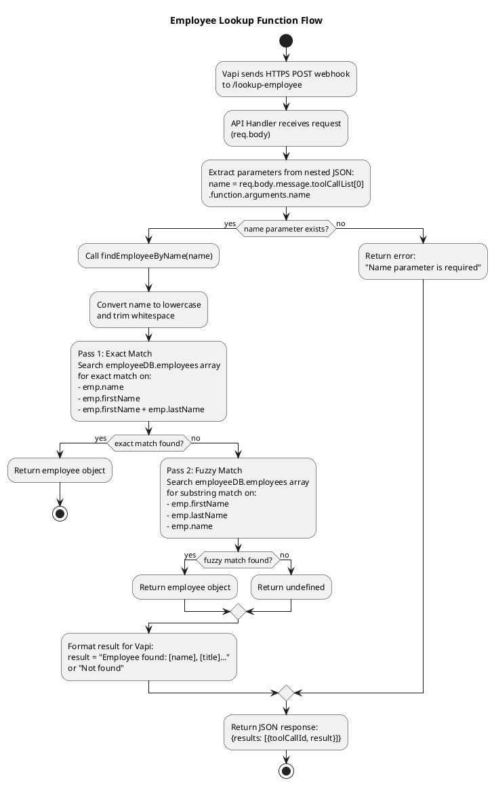
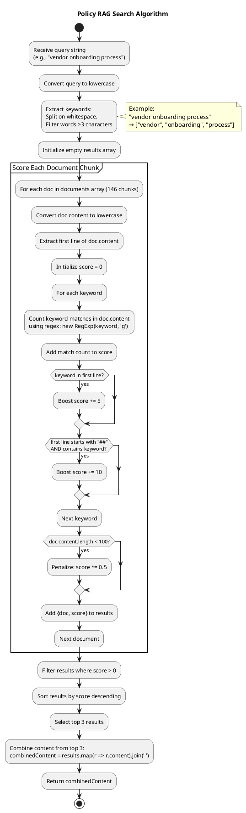
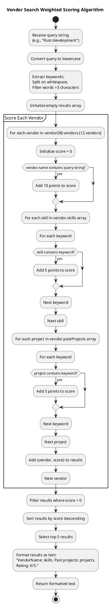

# C4 Model: Procurement Voice AI System

## Complete Architectural Documentation (All Four Levels)

---

# SECTION 1: Executive Summary

## System Overview

### System Name
**Procurement Voice AI System** (IOG Procurement Services Voice Assistant)

### Purpose
An intelligent voice assistant that handles incoming phone calls from internal departments at Input Output Global (IOG), automating the procurement request intake process by validating requests for completeness, answering policy questions through self-service, and providing vendor recommendations. The system eliminates 50% of time wasted by the procurement team on incomplete requests and repetitive questions by ensuring all requests are fully validated before reaching human procurement staff.

### Primary Users
- **Internal Employees** (Marketing, Engineering, Finance, Operations teams) who need to submit procurement requests or get procurement information
- **Procurement Manager** (Andrea Smith) who receives validated, complete procurement requests from the AI system

### Business Value
- **Time Savings**: Reduces procurement team administrative burden by 50%
- **Quality Improvement**: Ensures 100% of requests contain all required fields before submission
- **Self-Service**: Enables instant answers to common procurement questions without human intervention
- **Efficiency**: Accelerates request processing by 3-5 days through upfront validation

### Technology Stack
- **Frontend**: Voice interface via phone calls (PSTN network)
- **AI/ML**: OpenAI GPT-4 for natural language understanding, Deepgram for speech-to-text, PlayHT for text-to-speech
- **Backend**: Node.js v14+, Express.js 4.18.2
- **Data Storage**: JSON files (development), Markdown documents
- **Voice Platform**: Vapi AI (cloud SaaS)
- **Deployment**: Local development with ngrok tunnel; production-ready for Docker/Kubernetes
- **Infrastructure**: Designed for AWS/GCP/Azure cloud deployment

---

# SECTION 2: Level 1 - System Context Diagram

## 2.1 Purpose

This diagram shows how the Procurement Voice AI System fits into the world around it - who uses it and what other systems it integrates with. This is the highest-level view of the system.

**Audience**: Business stakeholders, product owners, clients, managers, non-technical team members

## 2.2 System Context Diagram

```plantuml
@startuml
!include https://raw.githubusercontent.com/plantuml-stdlib/C4-PlantUML/master/C4_Context.puml

LAYOUT_WITH_LEGEND()

title System Context Diagram - Procurement Voice AI System

Person(marketingTeam, "Marketing Team Member", "Submits procurement requests for marketing services, searches for marketing vendors")
Person(engineeringTeam, "Engineering Team Member", "Submits procurement requests for technical contractors, searches for Rust/blockchain vendors")
Person(financeTeam, "Finance Team Member", "Inquires about payment terms, budget approval policies, contract financial rules")
Person(operationsTeam, "Operations Team Member", "Submits procurement requests for operational services and general business needs")

Person(procurementMgr, "Procurement Manager\n(Andrea Smith)", "Receives validated procurement requests, benefits from 50% time savings")

System(procurementVoiceAI, "Procurement Voice AI System", "Voice-based AI assistant that validates procurement requests, answers policy questions, recommends vendors, and routes complete requests to procurement team")

System_Ext(vapiPlatform, "Vapi AI Platform", "Cloud voice telephony platform providing phone number, speech-to-text, text-to-speech, and call orchestration")

System_Ext(openaiGPT4, "OpenAI GPT-4", "Large language model providing natural language understanding, conversation management, and function calling capabilities")

System_Ext(deepgram, "Deepgram STT", "Speech-to-text transcription service converting voice to text (accessed via Vapi)")

System_Ext(playht, "PlayHT TTS", "Text-to-speech synthesis service converting AI responses to natural voice (accessed via Vapi)")

Rel(marketingTeam, procurementVoiceAI, "Calls via phone +1 (930) 254-9264", "Voice/PSTN")
Rel(engineeringTeam, procurementVoiceAI, "Calls via phone +1 (930) 254-9264", "Voice/PSTN")
Rel(financeTeam, procurementVoiceAI, "Calls via phone +1 (930) 254-9264", "Voice/PSTN")
Rel(operationsTeam, procurementVoiceAI, "Calls via phone +1 (930) 254-9264", "Voice/PSTN")

Rel(procurementVoiceAI, procurementMgr, "Routes validated requests", "Email/JIRA (future)")

Rel(procurementVoiceAI, vapiPlatform, "Integrates for voice interface", "HTTPS webhooks")
Rel(procurementVoiceAI, openaiGPT4, "Integrates for AI processing", "HTTPS REST API (via Vapi)")

Rel_Back(vapiPlatform, deepgram, "Uses for transcription", "HTTPS API")
Rel_Back(vapiPlatform, playht, "Uses for voice synthesis", "HTTPS API")

@enduml
```

## 2.3 Actors & External Systems

### Primary Actors (Users)

#### Marketing Team Members
- **Role**: Internal IOG marketing department employees
- **Goals**: Submit procurement requests for marketing services (agencies, campaigns, tools), find approved marketing vendors
- **How They Use the System**: Call the voice assistant to validate marketing procurement requests, search for vendors with marketing expertise, ask questions about contract templates for agency agreements
- **Pain Points Solved**: No more incomplete requests sent back, instant vendor recommendations, self-service policy answers

#### Engineering Team Members
- **Role**: Internal IOG engineering department employees
- **Goals**: Submit procurement requests for technical contractors and services, find vendors with specific technical skills
- **How They Use the System**: Call to search for Rust developers or blockchain consultants, validate technical procurement requests, ask about payment terms for contract developers
- **Pain Points Solved**: Quick discovery of pre-approved technical vendors, validated requests don't get rejected for missing information

#### Finance Team Members
- **Role**: Internal IOG finance department employees
- **Goals**: Understand procurement policies, especially payment terms and budget approval thresholds
- **How They Use the System**: Call to ask questions about upfront payment limits, fixed-price contract rules, budget validation requirements
- **Pain Points Solved**: Instant policy answers without waiting for procurement team email responses

#### Operations Team Members
- **Role**: Internal IOG operations department employees
- **Goals**: Submit procurement requests for operational services
- **How They Use the System**: Call to submit requests for office supplies, facility services, administrative support
- **Pain Points Solved**: Guided request submission ensures all required fields are collected upfront

#### Procurement Manager (Andrea Smith)
- **Role**: Manager of IOG's procurement team
- **Goals**: Receive only complete, validated procurement requests; reduce time spent on administrative tasks
- **How They Benefit**: AI system prevents incomplete requests from reaching her team, answers common questions automatically, routes only validated requests
- **Business Impact**: 50% reduction in time wasted on incomplete requests and repetitive questions

### External Systems

#### Vapi AI Platform
- **Type**: Cloud SaaS - Voice Telephony and AI Orchestration Platform
- **Purpose**: Provides phone number infrastructure, converts speech to text, synthesizes text to speech, manages call state, orchestrates AI conversations
- **Integration Method**: HTTPS webhooks from Vapi to MCP Server for function calling; Vapi API for configuration
- **Data Exchanged**:
  - **Inbound**: Voice audio from callers via PSTN network
  - **Outbound**: Transcribed text sent to OpenAI GPT-4; function call webhooks sent to MCP Server
  - **Return**: Function call results returned to Vapi; synthesized voice audio played to callers
- **Criticality**: Critical dependency - system cannot operate without Vapi

#### OpenAI GPT-4
- **Type**: Cloud SaaS - Large Language Model API
- **Purpose**: Natural language understanding, conversation management, intent detection, function calling decisions, response generation
- **Integration Method**: Accessed via Vapi platform; Vapi sends conversation context to GPT-4, receives AI responses and function calls
- **Data Exchanged**:
  - **Inbound**: Conversation history, user utterances (transcribed text), 3,800+ word system prompt, function tool definitions
  - **Outbound**: AI-generated responses (text), function call decisions with parameters
- **Configuration**: Model: `gpt-4`, Temperature: `0.7`, Function calling enabled
- **Criticality**: Critical dependency - system cannot process conversations without GPT-4

#### Deepgram Speech-to-Text
- **Type**: Cloud SaaS - Speech Recognition Service
- **Purpose**: Convert voice audio from callers into text transcriptions for AI processing
- **Integration Method**: Accessed transparently through Vapi platform (no direct integration from MCP Server)
- **Data Exchanged**:
  - **Inbound**: Voice audio streams from phone calls
  - **Outbound**: Text transcriptions
- **Performance**: Real-time streaming with <500ms latency

#### PlayHT Text-to-Speech
- **Type**: Cloud SaaS - Voice Synthesis Service
- **Purpose**: Convert AI-generated text responses into natural-sounding voice audio
- **Integration Method**: Accessed transparently through Vapi platform (no direct integration from MCP Server)
- **Data Exchanged**:
  - **Inbound**: Text responses from OpenAI GPT-4
  - **Outbound**: Synthesized voice audio
- **Voice Quality**: Natural-sounding, configurable voice selection

## 2.4 System Boundaries

### Inside the System Boundary
**What the IOG Procurement AI Team Builds and Maintains:**

- **Unified MCP Server**: Node.js/Express application containing all business logic
- **Employee Lookup Module**: Employee context search and profile retrieval
- **Procurement RAG Module**: Policy document search using keyword-based RAG algorithm
- **Vendor Search Module**: Vendor discovery with weighted keyword scoring
- **Request Validation Module**: Procurement request completeness validation
- **Employee Database**: JSON file with 5 employee profiles and procurement history
- **Vendor Database**: JSON file with 12 approved vendor records and contract history
- **Policy Document Repository**: 4 Markdown files containing procurement policies (vendor onboarding, contract templates, payment rules, FAQ)
- **AI System Prompt**: 3,800+ word prompt defining procurement assistant behavior
- **Configuration Scripts**: Automated tools for Vapi platform configuration
- **Deployment Infrastructure**: Docker containers, cloud deployment configurations (future)
- **API Endpoints**: 6 REST endpoints for function calling integration
- **Monitoring & Logging**: Health checks, reload mechanisms, system status

### Outside the System Boundary
**External Dependencies and Integrations:**

- **Vapi AI Platform**: Third-party SaaS for voice telephony and call management
- **OpenAI GPT-4**: Third-party LLM API for natural language processing
- **Deepgram**: Third-party speech-to-text service (via Vapi)
- **PlayHT**: Third-party text-to-speech service (via Vapi)
- **Phone Network (PSTN)**: Public telephone infrastructure for call delivery
- **Ngrok Tunnel**: Development tool for exposing local server (temporary; replaced in production)
- **Internal Callers' Devices**: Phones and mobile devices used by IOG employees
- **Future Integrations** (Planned but Not Yet Implemented):
  - JIRA API for automatic ticket creation
  - Tract API for vendor management integration
  - Finance API for budget validation
  - Email service for request notifications

---

# SECTION 3: Level 2 - Container Diagram

## 3.1 Purpose

This diagram zooms into the Procurement Voice AI System to show the high-level technical building blocks (containers) and how they interact at runtime. Containers represent deployable/runnable units like applications, databases, and services.

**Audience**: Solution architects, DevOps engineers, technical leads, infrastructure teams

## 3.2 Container Diagram

```plantuml
@startuml
!include https://raw.githubusercontent.com/plantuml-stdlib/C4-PlantUML/master/C4_Container.puml

LAYOUT_WITH_LEGEND()

title Container Diagram - Procurement Voice AI System

Person(internalEmployee, "Internal Employee", "Marketing, Engineering,\nFinance, Operations")
Person(procurementMgr, "Procurement Manager", "Andrea Smith")

System_Boundary(procurementAI, "Procurement Voice AI System") {

    Container(mcpServer, "Unified MCP Server", "Node.js v14+, Express 4.18", "Core API server handling business logic, data access, function orchestration (Port 3001)")

    ContainerDb(employeeDB, "Employee Database", "JSON File", "5 employee records: profiles, roles, preferences, procurement history")

    ContainerDb(vendorDB, "Vendor Database", "JSON File", "12 approved vendors: skills, projects, contracts, pricing, ratings")

    ContainerDb(policyDocs, "Policy Document Repository", "Markdown Files", "4 policy documents (146 chunks): vendor onboarding, contracts, payment rules, FAQ")

    Container(ngrokTunnel, "Ngrok Tunnel", "HTTP Proxy", "Exposes local server to internet for Vapi webhooks (development only)")
}

System_Ext(vapiPlatform, "Vapi AI Platform", "Cloud voice telephony:\nPhone +1 (930) 254-9264,\nSpeech-to-text (Deepgram),\nText-to-speech (PlayHT),\nCall management")

System_Ext(openaiGPT4, "OpenAI GPT-4", "Large language model:\nNatural language understanding,\nConversation management,\nFunction calling decisions")

Rel(internalEmployee, vapiPlatform, "Calls via phone", "Voice/PSTN")

Rel(vapiPlatform, openaiGPT4, "Sends conversation context", "HTTPS/REST API")
Rel_Back(openaiGPT4, vapiPlatform, "Returns AI responses", "HTTPS/REST")

Rel(vapiPlatform, ngrokTunnel, "Invokes function tools", "HTTPS Webhooks\nPOST /lookup-employee\nPOST /search-policies\nPOST /search-vendors\nPOST /validate-request")

Rel(ngrokTunnel, mcpServer, "Forwards requests", "HTTP/JSON\nlocalhost:3001")

Rel(mcpServer, employeeDB, "Reads employee data", "File I/O\nJSON parsing")
Rel(mcpServer, vendorDB, "Searches vendors", "File I/O\nJSON parsing\nKeyword scoring")
Rel(mcpServer, policyDocs, "Retrieves policies", "File I/O\nRAG search\nMarkdown parsing")

Rel_Back(mcpServer, ngrokTunnel, "Returns function results", "HTTP/JSON\nVapi response format")
Rel_Back(ngrokTunnel, vapiPlatform, "Delivers results", "HTTPS/JSON")

Rel(vapiPlatform, internalEmployee, "Speaks response", "Voice/PSTN\nSynthesized speech")

Rel(mcpServer, procurementMgr, "Routes validated requests", "Email/JIRA\n(Future integration)")

@enduml
```

## 3.3 Container Details

### Unified MCP Server
- **Type**: API Application / Backend Service
- **Technology**: Node.js (v14+), Express.js 4.18.2, JavaScript (ES6+)
- **Purpose**: Central application server that:
  - Exposes REST API endpoints for Vapi function calling
  - Executes business logic for employee lookup, policy search, vendor discovery, request validation
  - Manages data access to JSON databases and Markdown policy documents
  - Formats responses in Vapi-compatible webhook format
- **Deployment**:
  - **Development**: Runs locally via `node mcp-servers/unified-server.js`
  - **Production**: Containerized (Docker) and deployed to cloud (AWS ECS, Google Cloud Run, Kubernetes)
- **Port**: 3001 (configurable via `PORT` environment variable)
- **Scaling**: Stateless design allows horizontal scaling behind load balancer
- **Key Responsibilities**:
  - API request handling (6 endpoints)
  - Employee fuzzy name search
  - Policy document RAG search with keyword scoring
  - Vendor discovery with weighted scoring
  - Procurement request validation
  - Health checks and data hot-reloading
- **Dependencies**: dotenv (config), express (HTTP server), fs/path (file I/O)
- **Lines of Code**: ~450 lines in single file (future: extract into modules)

---

### Employee Database
- **Type**: Data Store / JSON File
- **Technology**: JSON file format
- **Purpose**: Store employee profiles with procurement history for personalized interactions
- **Deployment**: File stored in `/mcp-servers/employee-context/employee-database.json`
- **Scaling**: Current: In-memory loading (5 employees); Future: PostgreSQL or Redis for 1000+ employees
- **Key Responsibilities**:
  - Persist employee data (id, name, email, team, department, title, manager, projects, specialties, procurement history, preferences, notes)
  - Support fuzzy name matching for employee lookup
- **Data Model**: Array of employee objects with 5 records
- **Access Pattern**: Loaded into memory at server startup; hot-reloadable via `/reload` endpoint
- **Update Mechanism**: Manual file editing + server reload (no write API currently)
- **Production Migration**: Replace with PostgreSQL table with indexed name fields

---

### Vendor Database
- **Type**: Data Store / JSON File
- **Technology**: JSON file format
- **Purpose**: Store approved vendor information for discovery and recommendations
- **Deployment**: File stored in `/mcp-servers/vendor-context/vendor-database.json`
- **Scaling**: Current: In-memory loading (12 vendors); Future: PostgreSQL with full-text search for 1000+ vendors
- **Key Responsibilities**:
  - Persist vendor data (id, name, skills, past projects, contracts, discounts, contact info, ratings)
  - Support keyword-based search across skills and projects
- **Data Model**: Array of vendor objects with 12 records
- **Access Pattern**: Loaded into memory at server startup; hot-reloadable via `/reload` endpoint
- **Update Mechanism**: Manual file editing + server reload (no write API currently)
- **Production Migration**: Replace with PostgreSQL table with full-text indexes on skills/projects

---

### Policy Document Repository
- **Type**: Data Store / Markdown Files
- **Technology**: Markdown file format (.md)
- **Purpose**: Store procurement policy documents for RAG-based self-service question answering
- **Deployment**: 4 files in `/mcp-servers/procurement-rag/procurement-docs/`
  - `vendor-onboarding.md`: Vendor approval process
  - `contract-templates.md`: Contract template selection guidance
  - `payment-rules.md`: Payment term policies (upfront limits, milestones)
  - `procurement-faq.md`: Common procurement questions
- **Scaling**: Current: In-memory loading (146 chunks); Future: Elasticsearch or vector database (Pinecone) for 10,000+ chunks
- **Key Responsibilities**:
  - Persist policy content in human-readable Markdown format
  - Support section-based chunking on `##` and `###` headers
  - Enable keyword-based RAG search with TF-IDF-like scoring
- **Data Model**: 4 Markdown files split into 146 text chunks
- **Access Pattern**: Parsed and chunked at server startup; hot-reloadable via `/reload` endpoint
- **Update Mechanism**: Add/edit Markdown files + server reload
- **Production Migration**: Move to Elasticsearch or vector database with semantic search (embeddings)

---

### Ngrok Tunnel
- **Type**: HTTP Proxy / Development Tool
- **Technology**: Ngrok (free tier with static subdomain)
- **Purpose**: Expose local development server (localhost:3001) to public internet for Vapi webhook delivery
- **Deployment**: Runs locally via `ngrok http 3001 --domain=sprier-sulfurously-wendy.ngrok-free.dev`
- **URL**: `https://sprier-sulfurously-wendy.ngrok-free.dev` (static subdomain for development)
- **Scaling**: N/A (development tool only; not used in production)
- **Key Responsibilities**:
  - Create HTTPS tunnel from public internet to localhost:3001
  - Provide static URL for Vapi webhook configuration
  - Automatic SSL termination
- **Security**: Basic HTTPS; free tier has no authentication (production requires secured endpoints)
- **Production Replacement**: Not used in production; replaced with direct cloud server URL (e.g., `https://api.iog.com/procurement`)

---

### Vapi AI Platform (External SaaS)
- **Type**: External System / Cloud SaaS
- **Technology**: Proprietary voice AI platform
- **Purpose**: Provide complete voice telephony infrastructure and AI conversation orchestration
- **Deployment**: Fully managed SaaS; no deployment required
- **Scaling**: Vapi handles all scaling automatically
- **Key Responsibilities**:
  - Provide phone number: +1 (930) 254-9264
  - Accept incoming phone calls from PSTN network
  - Convert speech to text via Deepgram integration
  - Send conversation context to OpenAI GPT-4 for AI processing
  - Invoke custom function tools via HTTPS webhooks to MCP Server
  - Receive function call results from MCP Server
  - Generate AI responses via GPT-4
  - Convert AI responses to speech via PlayHT integration
  - Manage call state and session continuity
- **Integration Method**:
  - Configured via Vapi REST API (assistant creation, function tool registration)
  - Sends HTTPS POST webhooks to MCP Server for function calls
  - Receives JSON responses from MCP Server
- **API**: REST API for assistant configuration, call management, function tool definitions
- **SLA**: 99.9% uptime per Vapi service agreement

---

### OpenAI GPT-4 (External SaaS)
- **Type**: External System / Cloud SaaS
- **Technology**: Large language model (LLM) hosted by OpenAI
- **Purpose**: Provide natural language understanding and conversation intelligence
- **Deployment**: Fully managed SaaS; accessed via HTTPS API
- **Scaling**: OpenAI handles all scaling automatically
- **Key Responsibilities**:
  - Understand natural language user intents from transcribed speech
  - Determine which function tools to call based on conversation context
  - Extract parameters for function calls (employee names, search queries, request fields)
  - Generate natural, conversational responses in text format
  - Follow 3,800+ word system prompt defining procurement assistant behavior
  - Manage multi-turn conversations with context retention
- **Model Configuration**:
  - Model: `gpt-4`
  - Temperature: `0.7` (balanced creativity and consistency)
  - Function Calling: Enabled (4 custom functions)
- **Integration Method**: Invoked by Vapi platform via OpenAI API; no direct calls from MCP Server
- **Cost**: ~$0.03 per 1K tokens; typical call costs $0.15-$0.30

## 3.4 Inter-Container Communication

### Internal Employee → Vapi AI Platform
- **Protocol**: Voice over PSTN (Public Switched Telephone Network)
- **Data Format**: Audio (voice call)
- **Authentication**: None (public phone number)
- **Purpose**: User initiates phone call to interact with voice AI assistant
- **Flow**: User dials +1 (930) 254-9264 → Vapi receives call → begins conversation

---

### Vapi AI Platform → OpenAI GPT-4
- **Protocol**: HTTPS REST API (OpenAI API)
- **Data Format**: JSON (conversation history, function definitions, system prompt)
- **Authentication**: API key (managed by Vapi)
- **Purpose**: Send conversation context to GPT-4 for AI processing, receive responses and function calls
- **Flow**:
  1. Vapi sends conversation history + user utterance to GPT-4
  2. GPT-4 determines intent and decides which function to call (if any)
  3. GPT-4 returns function call decision with parameters OR generates direct response
  4. Vapi invokes function via webhook to MCP Server
  5. Vapi sends function result back to GPT-4
  6. GPT-4 generates final conversational response
- **Latency**: ~1-2 seconds per conversational turn

---

### Vapi AI Platform → Ngrok Tunnel → MCP Server
- **Protocol**: HTTPS (Vapi → Ngrok) then HTTP (Ngrok → localhost)
- **Data Format**: JSON (Vapi webhook format)
- **Authentication**: None (development); API key required in production
- **Purpose**: Invoke custom function tools when GPT-4 decides to call a function
- **Request Format**:
  ```json
  {
    "message": {
      "toolCallList": [{
        "id": "call_abc123",
        "function": {
          "name": "lookup_employee",
          "arguments": {
            "name": "Andrea"
          }
        }
      }]
    }
  }
  ```
- **Response Format**:
  ```json
  {
    "results": [{
      "toolCallId": "call_abc123",
      "result": "Employee found: Andrea Smith, Procurement Manager..."
    }]
  }
  ```
- **Latency**: ~100-300ms (network + processing)

---

### MCP Server → Employee Database
- **Protocol**: File I/O (synchronous reads)
- **Data Format**: JSON
- **Authentication**: N/A (local file system access)
- **Purpose**: Read employee data for fuzzy name matching
- **Flow**:
  1. Server startup: `loadEmployeeDB()` reads JSON file
  2. JSON.parse() deserializes data into JavaScript object
  3. Data stored in global `employeeDB` variable (in-memory cache)
  4. Requests: `findEmployeeByName()` searches in-memory cache
- **Performance**: ~5-10ms file read at startup; <1ms in-memory search per request

---

### MCP Server → Vendor Database
- **Protocol**: File I/O (synchronous reads)
- **Data Format**: JSON
- **Authentication**: N/A (local file system access)
- **Purpose**: Read vendor data for keyword-based search
- **Flow**:
  1. Server startup: `loadVendorDB()` reads JSON file
  2. JSON.parse() deserializes data
  3. Data stored in global `vendorDB` variable (in-memory cache)
  4. Requests: `searchVendors()` applies weighted keyword scoring to in-memory data
- **Performance**: ~10-20ms file read at startup; ~20-50ms keyword search per request

---

### MCP Server → Policy Document Repository
- **Protocol**: File I/O (synchronous reads)
- **Data Format**: Markdown (.md files)
- **Authentication**: N/A (local file system access)
- **Purpose**: Read and chunk policy documents for RAG-based search
- **Flow**:
  1. Server startup: `loadDocuments()` scans directory and reads all .md files
  2. Markdown parsing: split on `##` and `###` headers to create semantic chunks
  3. 146 chunks stored in global `documents` array (in-memory cache)
  4. Requests: `searchDocuments()` applies keyword scoring with header boosting
- **Performance**: ~50-100ms file read + parsing at startup; ~50-100ms RAG search per request

---

### MCP Server → Procurement Manager (Future)
- **Protocol**: HTTPS REST API (JIRA API) or SMTP (Email)
- **Data Format**: JSON (JIRA ticket) or HTML (Email)
- **Authentication**: API key or OAuth (JIRA); SMTP credentials (Email)
- **Purpose**: Route validated procurement requests to procurement team
- **Flow**:
  1. After request validation passes, create JIRA ticket with all request details
  2. Assign ticket to Andrea Smith's procurement queue
  3. Send email notification to procurement team
- **Status**: Not yet implemented (future enhancement)

## 3.5 Deployment Architecture

### Infrastructure

#### Current: Local Development with Ngrok
- **Environment**: Developer's local machine (macOS, Windows, Linux)
- **Server**: Node.js process running on `localhost:3001`
- **Tunnel**: Ngrok HTTP proxy exposing `localhost:3001` to `https://sprier-sulfurously-wendy.ngrok-free.dev`
- **Deployment Steps**:
  1. Start MCP Server: `node mcp-servers/unified-server.js`
  2. Start Ngrok: `ngrok http 3001 --domain=sprier-sulfurously-wendy.ngrok-free.dev`
  3. Configure Vapi: `node configure-complete-system.js https://sprier-sulfurously-wendy.ngrok-free.dev`
  4. Test: Call +1 (930) 254-9264
- **Pros**: Fast iteration, easy debugging, no deployment overhead
- **Cons**: Not production-ready, ngrok URL expires, single point of failure, developer machine must stay running

---

#### Recommended: Production Deployment on AWS

**Architecture**:
```
Internet (Phone Network)
   ↓
Vapi AI Platform (Cloud SaaS)
   ↓
Amazon Route 53 (DNS: api.iog.com)
   ↓
AWS Application Load Balancer (ALB)
   ↓
AWS ECS/Fargate (Container Orchestration)
   ├── Task 1: MCP Server Container (Port 3001)
   ├── Task 2: MCP Server Container (Port 3001)
   └── Task 3: MCP Server Container (Port 3001)
   ↓
Amazon RDS PostgreSQL (Employee + Vendor Data)
Amazon S3 (Policy Documents)
Amazon ElastiCache Redis (Search Result Caching)
Amazon CloudWatch (Logs, Metrics, Alarms)
```

**Components**:
- **Route 53**: DNS for `api.iog.com`
- **ALB**: Load balancer distributing traffic across ECS tasks
  - Health Check: GET `/health` every 30 seconds
  - SSL/TLS termination with AWS Certificate Manager
- **ECS/Fargate**: Managed container orchestration
  - Docker image: `procurement-voice-ai:v1.0`
  - Min instances: 2 (high availability)
  - Max instances: 10 (burst capacity)
  - Auto-scaling: CPU > 70% or request rate > 100 req/min
- **RDS PostgreSQL**: Replaces JSON files for employee and vendor data
  - Multi-AZ deployment for high availability
  - Read replicas for scaling read-heavy workloads
- **S3**: Stores policy Markdown documents
  - Versioning enabled for rollback capability
- **ElastiCache Redis**: Caches frequent searches
  - Cache employee lookups (1 hour TTL)
  - Cache policy search results (1 hour TTL)
- **CloudWatch**: Logging, metrics, and alarms
  - Logs: All API requests, errors, function calls
  - Metrics: Request count, latency, error rate, cache hit rate
  - Alarms: Error rate >10%, response time >5 seconds, server down >2 minutes

**Regions & Availability**:
- **Primary**: US-East-1 (Virginia) - 3 availability zones
- **Failover**: US-West-2 (Oregon) - disaster recovery (future)

**Deployment Strategy**: Blue-green deployment
- Deploy new version to "green" environment
- Run smoke tests
- Switch Route 53 traffic from "blue" to "green"
- Keep "blue" environment for 24 hours as rollback option

---

#### Alternative: Serverless Deployment on AWS Lambda

**Architecture**:
```
Vapi AI Platform
   ↓
API Gateway (HTTPS endpoint)
   ├── POST /lookup-employee → Lambda Function 1
   ├── POST /search-policies → Lambda Function 2
   ├── POST /search-vendors → Lambda Function 3
   └── POST /validate-request → Lambda Function 4
   ↓
Amazon DynamoDB (Employee + Vendor Data)
Amazon S3 (Policy Documents)
Amazon ElastiCache Serverless (Redis Caching)
```

**Pros**: Pay-per-use, infinite auto-scaling, no server management
**Cons**: Cold start latency (~1-2 seconds), requires refactoring to separate functions

---

### External Integrations

#### Authentication Providers
- **Current**: None (development)
- **Production**: AWS API Gateway with API keys or JWT tokens for securing `/lookup-employee`, `/search-policies`, etc.

#### Third-Party APIs (Currently Integrated)
- **Vapi AI Platform**: Voice telephony and conversation orchestration
- **OpenAI GPT-4**: Natural language understanding and generation
- **Deepgram** (via Vapi): Speech-to-text transcription
- **PlayHT** (via Vapi): Text-to-speech synthesis

#### Future Integrations (Planned)
- **JIRA API**: Automatic ticket creation for validated procurement requests
- **Tract API**: Vendor management system integration
- **Finance API**: Budget validation and approval workflow
- **Twilio API**: Backup voice provider (failover for Vapi)
- **SendGrid API**: Email notifications for request routing

---

# SECTION 4: Level 3 - Component Diagrams

## 4.1 Purpose

This diagram zooms into individual containers to show the major structural building blocks (components) and their interactions. Components represent modules, packages, classes, and services within a container.

**Audience**: Developers, software architects, technical reviewers, team leads

---

## 4.2 Component Diagrams

### 4.2.1 Unified MCP Server - Component Diagram

```plantuml
@startuml
!include https://raw.githubusercontent.com/plantuml-stdlib/C4-PlantUML/master/C4_Component.puml

LAYOUT_WITH_LEGEND()

title Component Diagram - Unified MCP Server (unified-server.js)

Container_Boundary(mcpServer, "Unified MCP Server (Node.js/Express)") {

    ' API Layer
    Component(apiLayer, "API Layer", "Express Routes", "HTTP request handlers\n6 REST endpoints\nVapi webhook parsing\nResponse formatting")

    ' Employee Module
    Container_Boundary(employeeModule, "Employee Context Module") {
        Component(employeeSvc, "Employee Service", "JavaScript Function", "findEmployeeByName()\nFuzzy name matching\nExact + partial search")
        Component(employeeRepo, "Employee Repository", "JavaScript Function", "loadEmployeeDB()\nJSON file loading\nIn-memory caching")
    }

    ' Procurement RAG Module
    Container_Boundary(procurementModule, "Procurement RAG Module") {
        Component(ragSvc, "RAG Search Service", "JavaScript Function", "searchDocuments()\nKeyword extraction\nTF-IDF-like scoring\nHeader boosting")
        Component(docRepo, "Document Repository", "JavaScript Function", "loadDocuments()\nMarkdown parsing\nSection chunking\nDirectory scanning")
    }

    ' Vendor Module
    Container_Boundary(vendorModule, "Vendor Context Module") {
        Component(vendorSvc, "Vendor Search Service", "JavaScript Function", "searchVendors()\nWeighted keyword scoring\nSkill/project matching\nTop-k selection")
        Component(vendorRepo, "Vendor Repository", "JavaScript Function", "loadVendorDB()\nJSON file loading\nIn-memory caching")
    }

    ' Validation Module
    Container_Boundary(validationModule, "Request Validation Module") {
        Component(validationSvc, "Validation Service", "JavaScript Function", "validateProcurementRequest()\nRequired field checks\nBusiness rule validation")
    }

    ' Utility Layer
    Component(utilityLayer, "Utility Layer", "Express Middleware", "Health checks (/health)\nData reloading (/reload)\nError handling\nRequest logging")
}

' External Systems
System_Ext(vapi, "Vapi AI Platform", "HTTPS webhooks")

' Data Stores
ComponentDb(employeeDB, "employee-database.json", "JSON File")
ComponentDb(vendorDB, "vendor-database.json", "JSON File")
ComponentDb(policyDocs, "procurement-docs/*.md", "Markdown Files")

' Relationships: Vapi → API Layer
Rel(vapi, apiLayer, "Sends webhooks", "HTTPS POST\nJSON body")

' Relationships: API Layer → Services
Rel(apiLayer, employeeSvc, "Calls", "lookup_employee(name)")
Rel(apiLayer, ragSvc, "Calls", "searchDocuments(query)")
Rel(apiLayer, vendorSvc, "Calls", "searchVendors(query)")
Rel(apiLayer, validationSvc, "Calls", "validateProcurementRequest(fields)")
Rel(apiLayer, utilityLayer, "Uses", "Health checks, reload")

' Relationships: Services → Repositories
Rel(employeeSvc, employeeRepo, "Uses", "Data access")
Rel(ragSvc, docRepo, "Uses", "Data access")
Rel(vendorSvc, vendorRepo, "Uses", "Data access")

' Relationships: Repositories → Data Stores
Rel(employeeRepo, employeeDB, "Reads", "fs.readFileSync()\nJSON.parse()")
Rel(docRepo, policyDocs, "Reads", "fs.readdirSync()\nfs.readFileSync()")
Rel(vendorRepo, vendorDB, "Reads", "fs.readFileSync()\nJSON.parse()")

' Response flow
Rel_Back(employeeSvc, apiLayer, "Returns", "Employee object")
Rel_Back(ragSvc, apiLayer, "Returns", "Document chunks")
Rel_Back(vendorSvc, apiLayer, "Returns", "Vendor array")
Rel_Back(validationSvc, apiLayer, "Returns", "Validation result")

Rel_Back(apiLayer, vapi, "Returns", "JSON response\nVapi format")

@enduml
```

### 4.2.2 Component Details for Unified MCP Server

#### Modules/Packages

##### Employee Context Module
- **Location**: `/mcp-servers/unified-server.js` (lines 13-98)
- **Purpose**: Manage employee profiles and provide personalized context for procurement interactions
- **Key Components**:
  - `findEmployeeByName()`: Service function for fuzzy name search
  - `loadEmployeeDB()`: Repository function for data loading
  - `POST /lookup-employee`: API endpoint handler
- **Dependencies**:
  - Internal: None (independent module)
  - External: Node.js `fs` module, global `employeeDB` variable

---

##### Procurement RAG Module
- **Location**: `/mcp-servers/unified-server.js` (lines 100-237)
- **Purpose**: Search procurement policy documents using Retrieval Augmented Generation with keyword-based scoring
- **Key Components**:
  - `searchDocuments()`: Service function for RAG search
  - `loadDocuments()`: Repository function for document parsing and chunking
  - `POST /search-policies`: API endpoint handler
- **Dependencies**:
  - Internal: None (independent module)
  - External: Node.js `fs` and `path` modules, global `documents` array

---

##### Vendor Context Module
- **Location**: `/mcp-servers/unified-server.js` (lines 239-338)
- **Purpose**: Search approved vendors by skills, past projects, and contract history
- **Key Components**:
  - `searchVendors()`: Service function for weighted keyword scoring
  - `loadVendorDB()`: Repository function for data loading
  - `POST /search-vendors`: API endpoint handler
- **Dependencies**:
  - Internal: None (independent module)
  - External: Node.js `fs` module, global `vendorDB` variable

---

##### Request Validation Module
- **Location**: `/mcp-servers/unified-server.js` (lines 340-389)
- **Purpose**: Validate procurement request completeness before routing to procurement team
- **Key Components**:
  - `validateProcurementRequest()`: Service function for field validation
  - `POST /validate-request`: API endpoint handler
- **Dependencies**:
  - Internal: None (no data dependencies; pure logic)
  - External: None (pure JavaScript validation)

---

#### Key Components

##### API Layer (Express Routes)
- **Type**: Controller Layer
- **Purpose**: Handle HTTP requests from Vapi webhooks, extract parameters from nested JSON structure, invoke business logic, format responses in Vapi-compatible format
- **Key Methods/Functions**:
  - `app.post('/lookup-employee', handler)`: Employee lookup endpoint (lines 47-98)
  - `app.post('/search-policies', handler)`: Policy search endpoint (lines 185-237)
  - `app.post('/search-vendors', handler)`: Vendor search endpoint (lines 294-338)
  - `app.post('/validate-request', handler)`: Request validation endpoint (lines 359-389)
  - `app.get('/health', handler)`: Health check endpoint (lines 395-403)
  - `app.post('/reload', handler)`: Data reload endpoint (lines 405-416)
- **Dependencies**: Express.js (`req`, `res` objects), all service layer functions
- **Design Patterns**: Controller pattern (orchestrate calls, no business logic)
- **Input Format**: Vapi webhook JSON with nested `message.toolCallList[0].function.arguments`
- **Output Format**: Vapi response JSON with `results: [{toolCallId, result}]`

---

##### Employee Service (findEmployeeByName)
- **Type**: Business Logic Service
- **Purpose**: Search employee database using two-pass fuzzy name matching algorithm
- **Key Methods/Functions**:
  - `findEmployeeByName(name)`: Main search function
    - **Pass 1**: Exact match on full name, first name, or last name (case-insensitive)
    - **Pass 2**: Substring match on any name field (fallback for partial names like "Andy" → "Andrea")
- **Dependencies**: `employeeDB` global variable (in-memory cache populated by `loadEmployeeDB()`)
- **Design Patterns**: Strategy pattern (two-pass search strategy)
- **Algorithm Complexity**: O(n) linear search (acceptable for 5-100 employees)
- **Input**: String name (first, last, or full name)
- **Output**: Employee object or `undefined` if not found

---

##### Employee Repository (loadEmployeeDB)
- **Type**: Data Access Layer
- **Purpose**: Load employee data from JSON file into memory cache
- **Key Methods/Functions**:
  - `loadEmployeeDB()`: Synchronous file read and JSON parsing
    - Read `employee-database.json` using `fs.readFileSync()`
    - Parse JSON using `JSON.parse()`
    - Return `{employees: []}` structure
    - Return empty array if file doesn't exist (graceful degradation)
- **Dependencies**: Node.js `fs` and `path` modules, `EMPLOYEE_DB_PATH` constant
- **Design Patterns**: Repository pattern (abstract data source), Cache-Aside pattern (in-memory caching)
- **Performance**: ~5-10ms file read + parse for 5-record JSON file
- **Caching**: Loads once at startup, stored in global `employeeDB` variable
- **Reload Mechanism**: Called again via `/reload` endpoint for hot reload

---

##### RAG Search Service (searchDocuments)
- **Type**: Business Logic Service
- **Purpose**: Search policy documents using keyword-based TF-IDF-like scoring with header boosting
- **Key Methods/Functions**:
  - `searchDocuments(query)`: Main RAG search function
    - Extract keywords from query (words >3 characters)
    - Score each document chunk by keyword frequency
    - Boost score 5x for keywords in first line (likely header)
    - Boost score 10x for keywords in markdown headers (`##`)
    - Penalize very short chunks (<100 chars) by 0.5x multiplier
    - Sort by score descending
    - Return top 3 results
- **Dependencies**: `documents` global array (in-memory cache populated by `loadDocuments()`)
- **Design Patterns**: Strategy pattern (keyword scoring strategy)
- **Algorithm Complexity**: O(n*m) where n=documents (146), m=keywords (typically 2-5)
- **Performance**: ~50-100ms average search time
- **Input**: String query (natural language question)
- **Output**: Array of top 3 document chunks with content and scores

---

##### Document Repository (loadDocuments)
- **Type**: Data Access Layer
- **Purpose**: Load and chunk policy documents from Markdown files into searchable array
- **Key Methods/Functions**:
  - `loadDocuments()`: File discovery, reading, parsing, and chunking
    - Scan `procurement-docs/` directory using `fs.readdirSync()`
    - Read each `.txt` and `.md` file using `fs.readFileSync()`
    - Split content on `##` headers (section boundaries) using regex `/(?=##\s)/g`
    - Further split on `###` subheaders (subsection boundaries) using regex `/(?=###\s)/g`
    - Create document chunk objects: `{id, filename, content}`
    - Store in global `documents` array (146 chunks total)
- **Dependencies**: Node.js `fs` and `path` modules, `PROCUREMENT_DOCS_PATH` constant
- **Design Patterns**: Repository pattern (abstract file reading), Cache-Aside pattern (in-memory caching)
- **Chunking Strategy**: Semantic chunking on Markdown headers to preserve context
- **Performance**: ~50-100ms for 4 files (~5-10KB each)
- **Reload Mechanism**: Called again via `/reload` endpoint

---

##### Vendor Search Service (searchVendors)
- **Type**: Business Logic Service
- **Purpose**: Search vendors using weighted keyword scoring across name, skills, and past projects
- **Key Methods/Functions**:
  - `searchVendors(query)`: Multi-field weighted scoring
    - Extract keywords from query (words >3 characters)
    - Score vendor name match: 10 points for substring match
    - Score skills match: 5 points per keyword match in `skills` array
    - Score projects match: 3 points per keyword match in `pastProjects` array
    - Sort by total score descending
    - Return top 5 vendors
- **Dependencies**: `vendorDB` global variable (in-memory cache populated by `loadVendorDB()`)
- **Design Patterns**: Strategy pattern (weighted scoring strategy)
- **Algorithm Complexity**: O(n*m) where n=vendors (12), m=keywords (typically 2-5)
- **Performance**: ~20-50ms average search time
- **Input**: String query (skill, project name, or vendor name)
- **Output**: Array of top 5 vendor objects with scores

---

##### Vendor Repository (loadVendorDB)
- **Type**: Data Access Layer
- **Purpose**: Load vendor data from JSON file into memory cache
- **Key Methods/Functions**:
  - `loadVendorDB()`: Synchronous file read and JSON parsing
    - Read `vendor-database.json` using `fs.readFileSync()`
    - Parse JSON using `JSON.parse()`
    - Return `{vendors: []}` structure
    - Return empty array if file doesn't exist
- **Dependencies**: Node.js `fs` and `path` modules, `VENDOR_DB_PATH` constant
- **Design Patterns**: Repository pattern, Cache-Aside pattern
- **Performance**: ~10-20ms file read + parse for 12-record JSON file
- **Caching**: Loads once at startup, stored in global `vendorDB` variable
- **Reload Mechanism**: Called again via `/reload` endpoint

---

##### Validation Service (validateProcurementRequest)
- **Type**: Business Logic Service
- **Purpose**: Validate procurement request contains all required fields per business rules
- **Key Methods/Functions**:
  - `validateProcurementRequest(fields)`: Field presence validation
    - Check required fields exist: `budget_number`, `milestones`, `costs`, `description`
    - Check optional fields: `deadline` (warning if missing)
    - Return object: `{missing: [], warnings: []}`
- **Dependencies**: None (pure JavaScript validation logic)
- **Design Patterns**: Validator pattern
- **Business Rules**:
  - 4 required fields must be present for request to be "complete"
  - Deadline is optional but recommended
- **Performance**: <5ms (simple boolean checks)
- **Input**: Object with procurement request fields
- **Output**: Validation result object with arrays of missing/warning fields

---

##### Utility Layer
- **Type**: System Management Utilities
- **Purpose**: Provide health checks for monitoring and hot data reloading without server restart
- **Key Methods/Functions**:
  - `GET /health`: System status endpoint
    - Returns: `{status: "ok", employees: 5, documents: 146, vendors: 12, message: "..."}`
    - Use Case: Load balancer health probes, Kubernetes liveness checks, monitoring
  - `POST /reload`: Hot reload endpoint
    - Calls: `loadEmployeeDB()`, `loadVendorDB()`, `loadDocuments()`
    - Returns: `{success: true, employees: 5, documents: 146, vendors: 12}`
    - Use Case: Reload data after updating JSON/Markdown files without downtime
- **Dependencies**: All repository loading functions
- **Performance**: Health check <5ms; reload ~100-200ms (file I/O)

### 4.2.3 Architectural Patterns

#### Patterns Used

##### Layered Architecture (4 Layers)
- **Layer 1 - API/Controller Layer**: Express route handlers
  - Responsibility: HTTP request/response, parameter extraction, response formatting
  - Rule: Controllers never contain business logic
- **Layer 2 - Business Logic/Service Layer**: JavaScript functions for business logic
  - Responsibility: Search algorithms, validation logic, data processing
  - Rule: Services don't know about HTTP; operate on pure data
- **Layer 3 - Data Access/Repository Layer**: File loading functions
  - Responsibility: Abstract data source details, provide clean interfaces
  - Rule: Repositories hide file formats from services
- **Layer 4 - Data Storage Layer**: JSON files, Markdown files
  - Responsibility: Persist data on disk
  - Rule: Read-only at runtime; updates require file edits + reload

---

##### Repository Pattern
- **Where**: `loadEmployeeDB()`, `loadDocuments()`, `loadVendorDB()`
- **Purpose**: Abstract data source details (file-based, database, API) behind simple loading functions
- **Benefit**: Services don't know about file formats; can swap storage implementations (JSON → PostgreSQL)

---

##### Strategy Pattern
- **Where**: Search services (employee, policy, vendor)
- **Purpose**: Each search service implements a different algorithm strategy
  - Employee: Exact/fuzzy name matching
  - Policy: Keyword-based RAG with TF-IDF-like scoring and header boosting
  - Vendor: Weighted multi-field scoring (name: 10, skills: 5, projects: 3)
- **Benefit**: Easily add new search strategies or swap algorithms without changing controllers

---

##### Cache-Aside Pattern
- **Where**: Repository functions load data once at startup
- **Purpose**: Avoid reloading data from disk on every request
- **Implementation**: Data loaded into global variables (`employeeDB`, `vendorDB`, `documents`)
- **Benefit**: Fast in-memory access; typical request completes in 20-100ms

---

##### Singleton Pattern (Implicit via Node.js Module Caching)
- **Where**: Global variables (`employeeDB`, `vendorDB`, `documents`)
- **Purpose**: Single shared instance of data across all requests
- **Implementation**: Node.js caches module state automatically
- **Benefit**: Memory-efficient; no redundant data loading

---

##### Factory Pattern (Implicit in Response Formatting)
- **Where**: API layer creates Vapi-compatible response objects
- **Purpose**: Centralized response format ensures consistency
- **Implementation**: All endpoints return: `{results: [{toolCallId, result}]}`
- **Benefit**: Easy to change response format in one place

---

#### Dependency Rules

##### Rule 1: One-Way Dependencies (Top-Down Flow)
- **Rule**: Dependencies flow in one direction only: Controllers → Services → Repositories → Storage
- **Enforcement**: No imports/requires from lower layers to upper layers
- **Current State**: ✅ Enforced - all data access goes through service functions
- **Benefit**: Changes to upper layers don't affect lower layers; testable in isolation

---

##### Rule 2: No Skip-Layer Dependencies
- **Rule**: Controllers must call services; services must call repositories; no skipping layers
- **Current State**: ✅ Enforced - no direct file access from controllers or services
- **Benefit**: Clean separation of concerns, easier testing, clearer code structure

---

##### Rule 3: Module Independence
- **Rule**: Functional modules (employee, procurement, vendor, validation) don't depend on each other
- **Current State**: ✅ Enforced - each module is self-contained with no cross-module function calls
- **Benefit**: Modules can be extracted into separate microservices in the future

---

##### Rule 4: Stateless Services
- **Rule**: Service functions don't maintain state between requests; operate on input parameters only
- **Current State**: ✅ Enforced - all services are pure functions (except for reading global data caches)
- **Benefit**: Thread-safe (Node.js is single-threaded anyway), horizontally scalable

---

##### Rule 5: Data Isolation
- **Rule**: Each module has its own data source; no shared databases between modules
- **Current State**: ✅ Enforced - employee, vendor, and policy modules each have separate data files
- **Benefit**: Modules can scale independently; no data coupling

---

# SECTION 5: Level 4 - Code Diagrams

## 5.1 Purpose

This is the most detailed level, showing how components are implemented in code (classes, interfaces, functions, algorithms). This level is for developers working on specific features who need to understand implementation details.

**Audience**: Developers actively coding, technical reviewers doing code reviews

## 5.2 Code Diagrams

### 5.2.1 Employee Lookup - Function Flow Diagram



### 5.2.2 Policy RAG Search - Algorithm Flow Diagram



### 5.2.3 Vendor Search - Weighted Scoring Diagram



## 5.2.2 Key Classes & Interfaces

### Global Data Structures

#### employeeDB Object
- **Purpose**: In-memory cache of employee data loaded from JSON file
- **Type**: Plain JavaScript Object
- **Structure**:
  ```javascript
  {
    employees: [
      {
        id: String,              // Unique identifier (e.g., "emp001")
        name: String,            // Full name (e.g., "Andrea Smith")
        firstName: String,       // First name for fuzzy matching
        lastName: String,        // Last name for fuzzy matching
        email: String,           // Email address
        team: String,            // Team name (e.g., "Procurement")
        department: String,      // Department (e.g., "Procurement & Vendor Management")
        title: String,           // Job title
        location: String,        // Office location
        manager: String,         // Manager's name
        directReports: String[], // Names of direct reports
        projects: String[],      // Active projects
        specialties: String[],   // Areas of expertise
        procurementHistory: [    // Past procurement interactions
          {
            date: String,        // ISO date string
            type: String,        // Type of interaction
            description: String  // Details
          }
        ],
        preferences: {           // Communication preferences
          communicationStyle: String,
          timezone: String,
          urgentContactMethod: String
        },
        notes: String            // Additional context
      }
    ]
  }
  ```
- **Initialization**: Loaded at server startup via `loadEmployeeDB()`
- **Access Pattern**: Read-only after initialization; no writes at runtime

---

#### vendorDB Object
- **Purpose**: In-memory cache of vendor data loaded from JSON file
- **Type**: Plain JavaScript Object
- **Structure**:
  ```javascript
  {
    vendors: [
      {
        id: String,              // Unique identifier (e.g., "vendor001")
        name: String,            // Vendor company name
        skills: String[],        // Capabilities (e.g., ["Rust engineers", "Blockchain development"])
        pastProjects: String[],  // Past project names (e.g., ["Leos", "Cardano integration"])
        averageDiscount: String, // Discount percentage (e.g., "8%")
        contracts: [             // Contract history
          {
            date: String,        // Contract date
            value: String,       // Contract value (e.g., "$180,000")
            type: String,        // Type (e.g., "Fixed price", "Time and materials")
            project: String,     // Project name
            duration: String     // Duration (e.g., "6 months")
          }
        ],
        contactInfo: {           // Contact details
          email: String,
          phone: String,
          website: String
        },
        status: String,          // Approval status (e.g., "approved")
        notes: String,           // Additional info
        rating: String           // Performance rating (e.g., "4.8/5")
      }
    ]
  }
  ```
- **Initialization**: Loaded at server startup via `loadVendorDB()`
- **Access Pattern**: Read-only after initialization

---

#### documents Array
- **Purpose**: In-memory cache of chunked policy document sections
- **Type**: Array of Objects
- **Structure**:
  ```javascript
  [
    {
      id: String,          // Unique chunk ID (e.g., "vendor-onboarding.md-section-0-0")
      filename: String,    // Source file (e.g., "vendor-onboarding.md")
      content: String      // Chunk content (section of Markdown document)
    }
  ]
  ```
- **Size**: 146 chunks from 4 Markdown files
- **Initialization**: Loaded at server startup via `loadDocuments()`
- **Chunking**: Split on `##` and `###` Markdown headers
- **Access Pattern**: Read-only after initialization; searched via `searchDocuments()`

---

### Core Functions

#### findEmployeeByName(name)
- **Purpose**: Search employee database using two-pass fuzzy matching
- **Input**: `name` (String) - employee name (first, last, or full)
- **Output**: Employee object or `undefined`
- **Algorithm**:
  ```javascript
  function findEmployeeByName(name) {
    const nameLower = name.toLowerCase().trim();

    // Pass 1: Exact match
    let employee = employeeDB.employees.find(emp =>
      emp.name.toLowerCase() === nameLower ||
      emp.firstName.toLowerCase() === nameLower ||
      `${emp.firstName.toLowerCase()} ${emp.lastName.toLowerCase()}` === nameLower
    );

    // Pass 2: Fuzzy match (substring)
    if (!employee) {
      employee = employeeDB.employees.find(emp =>
        emp.firstName.toLowerCase().includes(nameLower) ||
        emp.lastName.toLowerCase().includes(nameLower) ||
        emp.name.toLowerCase().includes(nameLower)
      );
    }

    return employee;
  }
  ```
- **Complexity**: O(n) where n = number of employees
- **Performance**: <1ms for 5-100 employees

---

#### searchDocuments(query)
- **Purpose**: RAG search with keyword-based TF-IDF-like scoring
- **Input**: `query` (String) - natural language question
- **Output**: Array of top 3 document chunks with content
- **Algorithm**:
  ```javascript
  function searchDocuments(query) {
    const queryLower = query.toLowerCase();
    const keywords = queryLower.split(' ').filter(word => word.length > 3);

    const results = documents.map(doc => {
      let score = 0;
      const contentLower = doc.content.toLowerCase();
      const firstLine = doc.content.split('\n')[0].toLowerCase();

      keywords.forEach(keyword => {
        const matches = (contentLower.match(new RegExp(keyword, 'g')) || []).length;
        score += matches;

        if (firstLine.includes(keyword)) {
          score += 5; // Boost for header keywords
        }

        if (firstLine.startsWith('##') && firstLine.includes(keyword)) {
          score += 10; // Extra boost for markdown headers
        }
      });

      if (doc.content.length < 100) {
        score = score * 0.5; // Penalize short chunks
      }

      return { ...doc, score };
    })
    .filter(doc => doc.score > 0)
    .sort((a, b) => b.score - a.score)
    .slice(0, 3);

    return results;
  }
  ```
- **Complexity**: O(n*m) where n = documents (146), m = keywords (2-5)
- **Performance**: ~50-100ms average

---

#### searchVendors(query)
- **Purpose**: Vendor search with weighted multi-field scoring
- **Input**: `query` (String) - skill, project, or vendor name
- **Output**: Array of top 5 vendors sorted by relevance
- **Algorithm**:
  ```javascript
  function searchVendors(query) {
    const queryLower = query.toLowerCase();
    const keywords = queryLower.split(' ').filter(word => word.length > 3);

    const results = vendorDB.vendors.map(vendor => {
      let score = 0;

      // Score vendor name (10 points)
      if (vendor.name.toLowerCase().includes(queryLower)) {
        score += 10;
      }

      // Score skills (5 points per match)
      vendor.skills.forEach(skill => {
        keywords.forEach(keyword => {
          if (skill.toLowerCase().includes(keyword)) {
            score += 5;
          }
        });
      });

      // Score past projects (3 points per match)
      vendor.pastProjects.forEach(project => {
        keywords.forEach(keyword => {
          if (project.toLowerCase().includes(keyword)) {
            score += 3;
          }
        });
      });

      return { ...vendor, score };
    })
    .filter(v => v.score > 0)
    .sort((a, b) => b.score - a.score)
    .slice(0, 5);

    return results;
  }
  ```
- **Complexity**: O(n*m*k) where n = vendors (12), m = keywords (2-5), k = avg skills/projects per vendor (5-10)
- **Performance**: ~20-50ms average

---

#### validateProcurementRequest(fields)
- **Purpose**: Validate procurement request completeness
- **Input**: `fields` (Object) - procurement request fields
- **Output**: `{missing: Array, warnings: Array}`
- **Algorithm**:
  ```javascript
  function validateProcurementRequest(fields) {
    const missing = [];
    const warnings = [];

    // Required fields
    if (!fields.budget_number) missing.push("budget number");
    if (!fields.milestones) missing.push("milestones");
    if (!fields.costs) missing.push("cost breakdown");
    if (!fields.description) missing.push("project description");

    // Optional but recommended
    if (!fields.deadline) warnings.push("deadline or timeline");

    return { missing, warnings };
  }
  ```
- **Complexity**: O(1) constant time
- **Performance**: <5ms

## 5.2.3 Data Models

### Employee Model
- **Purpose**: Represent an IOG employee with full profile and procurement history
- **Fields**:
  - `id`: String - Unique identifier (e.g., "emp001")
  - `name`: String - Full name (e.g., "Andrea Smith")
  - `firstName`: String - First name for search matching
  - `lastName`: String - Last name for search matching
  - `email`: String - Email address
  - `team`: String - Team name (e.g., "Procurement")
  - `department`: String - Department (e.g., "Procurement & Vendor Management")
  - `title`: String - Job title (e.g., "Procurement Manager")
  - `location`: String - Office location
  - `manager`: String - Manager's name
  - `directReports`: Array<String> - Names of direct reports
  - `projects`: Array<String> - Active projects
  - `specialties`: Array<String> - Areas of expertise
  - `procurementHistory`: Array<{date, type, description}> - Past procurement interactions
  - `preferences`: Object - Communication preferences (style, timezone, contact method)
  - `notes`: String - Additional context for personalization
- **Relationships**: None (flat structure)
- **Validation Rules**:
  - `id` must be unique
  - `name`, `firstName`, `lastName`, `email` are required
- **Database Mapping**: Currently JSON file; future: PostgreSQL table `employees` with indexes on `firstName`, `lastName`

---

### Vendor Model
- **Purpose**: Represent an approved vendor with skills, contract history, and performance data
- **Fields**:
  - `id`: String - Unique identifier (e.g., "vendor001")
  - `name`: String - Company name
  - `skills`: Array<String> - Capabilities (e.g., ["Rust engineers", "Blockchain"])
  - `pastProjects`: Array<String> - Past project names
  - `averageDiscount`: String - Discount percentage (e.g., "8%")
  - `contracts`: Array<{date, value, type, project, duration}> - Contract history
  - `contactInfo`: Object - Contact details (email, phone, website)
  - `status`: String - Approval status (e.g., "approved")
  - `notes`: String - Additional information
  - `rating`: String - Performance rating (e.g., "4.8/5")
- **Relationships**: None (flat structure)
- **Validation Rules**:
  - `id` must be unique
  - `name`, `skills`, `status` are required
- **Database Mapping**: Currently JSON file; future: PostgreSQL table `vendors` with full-text search indexes on `skills` and `pastProjects`

---

### Document Chunk Model
- **Purpose**: Represent a searchable chunk of a policy document
- **Fields**:
  - `id`: String - Unique chunk identifier (e.g., "vendor-onboarding.md-section-0-0")
  - `filename`: String - Source file name (e.g., "vendor-onboarding.md")
  - `content`: String - Chunk content (section of Markdown)
- **Relationships**: Parent-child relationship to source file (filename)
- **Validation Rules**:
  - `content` must not be empty
  - `filename` must reference existing file
- **Database Mapping**: Currently in-memory array; future: Elasticsearch index with full-text search or vector database (Pinecone) with embeddings

---

### Procurement Request Model (Input)
- **Purpose**: Represent a procurement request submitted by caller
- **Fields**:
  - `budget_number`: String - Budget code (required)
  - `milestones`: String - Project milestones (required)
  - `costs`: String - Cost breakdown (required)
  - `description`: String - Project description (required)
  - `deadline`: String - Timeline (optional but recommended)
- **Relationships**: None (data transfer object)
- **Validation Rules**: 4 required fields must be present for completeness
- **Database Mapping**: N/A (not persisted; only validated and forwarded)

## 5.2.4 Critical Algorithms & Business Logic

### Employee Fuzzy Name Matching Algorithm
- **Location**: `/mcp-servers/unified-server.js`, function `findEmployeeByName()`, lines 26-44
- **Purpose**: Find employees by name with tolerance for variations (first name only, nicknames, misspellings)
- **Input**: User-provided name string (e.g., "Andy", "Andrea", "Andrea Smith")
- **Output**: Employee object or `undefined`
- **Steps**:
  1. Normalize input: convert to lowercase, trim whitespace
  2. **Pass 1 - Exact Match**: Search for exact match on:
     - `emp.name` (full name)
     - `emp.firstName` (first name only)
     - `emp.firstName + emp.lastName` (computed full name)
  3. If found, return employee immediately
  4. **Pass 2 - Fuzzy Match**: Search for substring match on:
     - `emp.firstName.includes(input)` (e.g., "And" matches "Andrea")
     - `emp.lastName.includes(input)`
     - `emp.name.includes(input)`
  5. Return first matching employee or `undefined`
- **Complexity**: O(n) where n = number of employees
- **Edge Cases**:
  - Empty string: returns `undefined`
  - Multiple partial matches: returns first match (should be rare with good data)
  - Case variations: handled by `.toLowerCase()`
  - Extra whitespace: handled by `.trim()`

---

### Policy RAG Search with Header Boosting
- **Location**: `/mcp-servers/unified-server.js`, function `searchDocuments()`, lines 145-182
- **Purpose**: Find most relevant policy document sections for a natural language query
- **Input**: Natural language query (e.g., "What's the vendor onboarding process?")
- **Output**: Top 3 document chunks sorted by relevance
- **Steps**:
  1. **Keyword Extraction**: Split query on whitespace, filter words >3 characters
  2. **Scoring Loop**: For each document chunk:
     a. Count keyword matches in content using regex
     b. Add match count to score (TF-like scoring)
     c. **Header Boosting**: If keyword appears in first line, add 5 bonus points
     d. **Markdown Header Boosting**: If first line is `##` header with keyword, add 10 bonus points
     e. **Short Chunk Penalty**: If content < 100 chars, multiply score by 0.5
  3. **Filtering**: Remove chunks with score = 0 (no keyword matches)
  4. **Ranking**: Sort chunks by score descending
  5. **Top-K Selection**: Return top 3 chunks
  6. **Result Formatting**: Combine content from top 3 chunks into single string
- **Complexity**: O(n*m) where n = documents (146), m = keywords (2-5)
- **Rationale**:
  - Header boosting prioritizes document sections that are explicitly about the query topic
  - Short chunk penalty avoids returning incomplete fragments
  - Top-3 selection provides enough context without overwhelming the AI
- **Edge Cases**:
  - No matches: returns empty array, API returns "No relevant policies found"
  - Very broad query (many matches): still returns top 3 most relevant
  - Query with stopwords: filtered out by >3 character rule

---

### Vendor Weighted Keyword Scoring
- **Location**: `/mcp-servers/unified-server.js`, function `searchVendors()`, lines 254-291
- **Purpose**: Find vendors matching specific skills or past project experience with relevance ranking
- **Input**: Search query (e.g., "Rust development", "blockchain consultants")
- **Output**: Top 5 vendors sorted by relevance score
- **Steps**:
  1. **Keyword Extraction**: Split query on whitespace, filter words >3 characters
  2. **Scoring Loop**: For each vendor:
     a. **Name Match**: If vendor name contains full query string, add 10 points
     b. **Skills Match**: For each skill, for each keyword, if skill contains keyword, add 5 points
     c. **Projects Match**: For each past project, for each keyword, if project contains keyword, add 3 points
     d. Total score = name + skills + projects points
  3. **Filtering**: Remove vendors with score = 0
  4. **Ranking**: Sort vendors by score descending
  5. **Top-K Selection**: Return top 5 vendors
  6. **Result Formatting**: Format as readable text with skills, projects, rating
- **Complexity**: O(n*m*k) where n = vendors (12), m = keywords (2-5), k = avg items per vendor (5-10)
- **Weight Rationale**:
  - **Name (10 pts)**: Highest weight because exact name match is most relevant
  - **Skills (5 pts)**: High weight because skills are primary search criteria
  - **Projects (3 pts)**: Lower weight because projects are indirect evidence of capability
- **Edge Cases**:
  - No matches: returns empty array, API returns "No vendors found"
  - Vendor matches on both skills and projects: cumulative scoring rewards comprehensive matches
  - Multiple keywords: vendors matching more keywords score higher

---

### Request Completeness Validation
- **Location**: `/mcp-servers/unified-server.js`, function `validateProcurementRequest()`, lines 344-356
- **Purpose**: Ensure procurement requests contain all required fields before routing to procurement team
- **Input**: Object with request fields (budget_number, milestones, costs, description, deadline)
- **Output**: `{missing: Array, warnings: Array}`
- **Steps**:
  1. Initialize empty arrays: `missing`, `warnings`
  2. **Required Field Checks**: For each required field, if missing or falsy, add to `missing` array
     - `budget_number`: Required (budget code)
     - `milestones`: Required (project milestones/deliverables)
     - `costs`: Required (cost breakdown)
     - `description`: Required (project description)
  3. **Optional Field Checks**: For each optional field, if missing, add to `warnings` array
     - `deadline`: Optional but recommended
  4. Return validation result
- **Business Rules**:
  - Request is "complete" only if `missing` array is empty
  - Warnings don't prevent submission but AI informs user they're recommended
- **Future Enhancements**:
  - Budget number format validation (regex pattern)
  - Cost validation (numeric, within budget range)
  - Milestone date parsing and validation
  - Description length validation (minimum 50 characters)

---

# SECTION 6: Cross-Cutting Concerns

## 6.1 Security

### Authentication Approach
- **Current State**: None (development environment)
- **Production Requirements**:
  - API key authentication for webhook endpoints (`/lookup-employee`, `/search-policies`, etc.)
  - JWT tokens for `/reload` endpoint (admin-only)
  - HTTPS only (no plain HTTP accepted)
  - Vapi webhook signature verification (HMAC-SHA256)

### Authorization Model
- **Current State**: No authorization (all endpoints publicly accessible in development)
- **Production Requirements**:
  - **Public Endpoints**: `/lookup-employee`, `/search-policies`, `/search-vendors`, `/validate-request` (authenticated by Vapi webhook signature)
  - **Admin Endpoints**: `/reload` (require JWT with admin role)
  - **Monitoring Endpoints**: `/health` (publicly accessible for load balancer health checks)

### Data Encryption
- **In Transit**: HTTPS for all external communications (Vapi ↔ MCP Server)
- **At Rest**:
  - **Current**: JSON files stored unencrypted on local disk
  - **Production**: Database encryption enabled (AWS RDS encryption at rest, PostgreSQL `pg_crypto` for sensitive fields)
- **Sensitive Data**: Employee email addresses, vendor contact info (consider encrypting in production)

### Security Best Practices Implemented
- Environment variables for API keys (not hardcoded)
- `.gitignore` prevents committing `.env` files
- Input parameter validation (check for required fields)
- **Future Enhancements**:
  - Rate limiting (prevent DoS attacks)
  - Input sanitization (prevent injection attacks)
  - CORS configuration (whitelist Vapi domains)
  - Webhook signature verification (ensure requests from Vapi only)

---

## 6.2 Error Handling

### Error Handling Strategy
- **API Layer**: Return error messages in Vapi-compatible format with 400/500 status codes
  - **400 Bad Request**: Missing required parameters, invalid input
  - **500 Internal Server Error**: Unexpected errors (catch-all for unhandled exceptions)
- **Service Layer**: Return `undefined` or empty arrays for "not found" cases (graceful degradation)
- **Repository Layer**: Return empty data structures if files missing (prevent crashes)

### Logging Approach
- **Current**: Console logging to stdout (`console.log`, `console.error`)
- **Log Levels**:
  - **INFO**: Server startup, data loading, endpoint requests
  - **ERROR**: File I/O failures, parsing errors, missing parameters
- **Log Format**: Plain text with timestamps (future: structured JSON logs)
- **Production Logging**:
  - Centralized logging (AWS CloudWatch, ELK Stack, or Datadog)
  - Structured logs with request IDs for tracing
  - Log aggregation and search
  - Log retention: 30 days (compliance requirement)

### Monitoring and Alerting
- **Current State**: No monitoring (manual testing only)
- **Production Monitoring**:
  - **Health Checks**: `/health` endpoint monitored every 30 seconds
  - **Metrics**: Request count, latency (p50, p95, p99), error rate
  - **Alerts**:
    - **Critical**: Server down >2 minutes, error rate >10%
    - **Warning**: Error rate >5%, response time >3 seconds, memory usage >80%
  - **Tools**: AWS CloudWatch, Prometheus + Grafana, or Datadog

---

## 6.3 Testing Strategy

### Unit Testing Approach
- **Current State**: No automated unit tests (manual testing scripts only)
- **Recommended**:
  - **Framework**: Jest or Mocha + Chai
  - **Coverage Goal**: 80%+ for service functions
  - **Test Files**: `/tests/unit/` directory mirroring source structure
  - **Example Tests**:
    - `findEmployeeByName()`: Test exact match, fuzzy match, not found, empty input
    - `searchDocuments()`: Test keyword extraction, scoring, top-k selection, no matches
    - `searchVendors()`: Test name match, skills match, projects match, weighted scoring
    - `validateProcurementRequest()`: Test all required fields, missing fields, warnings

### Integration Testing
- **Current State**: Manual testing with `test-*.js` scripts
- **Recommended**:
  - **Framework**: Supertest (for Express API testing)
  - **Coverage Goal**: 100% of API endpoints
  - **Test Files**: `/tests/integration/` directory
  - **Example Tests**:
    - Test `/lookup-employee` with valid name, invalid name, missing parameter
    - Test `/search-policies` with various queries, check response format
    - Test `/health` endpoint returns correct counts
    - Test `/reload` endpoint updates data

### End-to-End Testing
- **Current State**: Manual phone call testing
- **Recommended**:
  - **Framework**: Custom test harness (simulate Vapi webhooks)
  - **Test Scenarios**:
    - Full call flow: employee lookup → policy search → vendor search → request validation
    - Multi-turn conversation simulation
    - Error handling (missing data, invalid input)
  - **Test Files**: `/tests/e2e/` directory

### Test Coverage Goals
- **Unit Tests**: 80%+ line coverage
- **Integration Tests**: 100% endpoint coverage
- **E2E Tests**: 100% user flow coverage (key scenarios)

---

## 6.4 Performance Considerations

### Caching Strategies
- **Current**: In-memory caching of all data at server startup (employees, vendors, policy chunks)
- **Cache Invalidation**: Hot reload via `/reload` endpoint (manual trigger)
- **Production Enhancements**:
  - **Redis Cache**: Cache search results (employee lookups, policy searches, vendor searches)
    - TTL: 1 hour (data rarely changes)
    - Cache key: Hash of request parameters
    - Hit rate target: 70%+
  - **CDN Caching**: Cache static assets (HTML documentation files) with CloudFront

### Database Optimization
- **Current**: File-based JSON storage (no database queries)
- **Production Database Optimizations**:
  - **PostgreSQL**:
    - Indexes on `employees.firstName`, `employees.lastName` for fast name lookups
    - Full-text search indexes on `vendors.skills`, `vendors.pastProjects` using `pg_trgm`
    - Connection pooling (PgBouncer or native pooling)
  - **Elasticsearch** (for policy documents):
    - Full-text indexes on document content
    - Aggregations for faceted search

### Async Processing
- **Current**: Synchronous request handling (blocking I/O)
- **Opportunities**:
  - Asynchronous file I/O (`fs.promises`) for data loading
  - Parallel searches (search employees, policies, vendors concurrently)
  - Background job queue for request routing (JIRA ticket creation)

### Performance Bottlenecks
- **Current Bottlenecks**:
  - Synchronous file I/O at startup (~100-200ms)
  - O(n) linear search algorithms (acceptable for current data size)
- **Future Bottlenecks** (at scale):
  - 1000+ employees: Name search becomes slow (>500ms)
  - 10,000+ policy chunks: RAG search becomes slow (>1 second)
  - High request rate (>100 req/min): Single Node.js instance saturates CPU
- **Mitigation**:
  - Database with indexes for sub-10ms queries
  - Horizontal scaling with load balancer
  - Redis cache for 70%+ cache hit rate

---

## 6.5 Data Management

### Data Persistence Strategy
- **Current**: File-based storage (JSON, Markdown)
  - **Pros**: Simple, human-readable, version-controlled
  - **Cons**: No ACID transactions, no concurrent writes, limited scalability
- **Production Strategy**:
  - **Structured Data** (employees, vendors): PostgreSQL
  - **Unstructured Data** (policy documents): Elasticsearch or S3 + metadata in PostgreSQL
  - **Cache**: Redis for hot data (search results, employee lookups)

### Backup and Recovery
- **Current**: Git repository backups only (manual commits)
- **Production Requirements**:
  - **Database Backups**:
    - Automated daily backups (AWS RDS automatic backups)
    - Point-in-time recovery (PITR) for last 7 days
    - Weekly snapshots retained for 30 days
  - **File Backups**:
    - Policy documents versioned in S3 with versioning enabled
    - Cross-region replication to DR region
  - **Recovery Time Objective (RTO)**: 1 hour
  - **Recovery Point Objective (RPO)**: 1 hour (max acceptable data loss)

### Data Migration Approach
- **Current Migration Process**:
  - Manual file editing
  - Server reload via `/reload` endpoint or restart
- **Production Migration Strategy**:
  - **Schema Migrations**: Flyway or Liquibase for database schema versioning
  - **Data Migrations**: SQL scripts or Node.js migration scripts
  - **Blue-Green Deployment**: Run migrations in "green" environment before switching traffic
  - **Rollback Plan**: Database snapshots before migration, rollback SQL scripts

### Data Retention Policies
- **Current**: No retention policy (data kept indefinitely in files)
- **Production Requirements**:
  - **Employee Data**: Retained while employee is active; archived (not deleted) after termination
  - **Vendor Data**: Retained indefinitely (contract history is compliance requirement)
  - **Policy Documents**: Version history retained for 7 years (compliance)
  - **Logs**: 30 days retention (cost optimization)
  - **Backups**: 30 days retention (compliance)

---

# SECTION 7: Development Guidelines

## 7.1 Code Organization

### Directory Structure Philosophy
- **Principle**: Organize by business capability (functional modules), not by technical layer
- **Rationale**:
  - Makes it easy to understand what each module does
  - Modules can be extracted into separate microservices later
  - Aligns with Domain-Driven Design (DDD) principles
- **Current Structure**:
  ```
  /mcp-servers
    /employee-context        # Employee module (all employee-related code)
    /procurement-rag         # Procurement RAG module (all policy-related code)
    /vendor-context          # Vendor module (all vendor-related code)
    unified-server.js        # Integration layer (combines all modules)
  ```
- **Future Refactoring** (when modules exceed 500 lines):
  ```
  /mcp-servers
    /employee
      ├── controller.js      # API handlers
      ├── service.js         # Business logic
      ├── repository.js      # Data access
      └── data/
          └── employee-database.json
    /procurement
      ├── controller.js
      ├── service.js
      ├── repository.js
      └── docs/
          └── *.md
    /vendor
      ├── controller.js
      ├── service.js
      ├── repository.js
      └── data/
          └── vendor-database.json
    /shared
      ├── middleware.js      # Shared Express middleware
      └── utils.js           # Shared utilities
    server.js                # Main entry point
  ```

### Naming Conventions
- **Files**: `kebab-case.js` (e.g., `unified-server.js`, `employee-database.json`)
- **Functions**: `camelCase` (e.g., `findEmployeeByName()`, `searchDocuments()`)
- **Variables**: `camelCase` (e.g., `employeeDB`, `documents`)
- **Constants**: `UPPER_SNAKE_CASE` (e.g., `EMPLOYEE_DB_PATH`, `PORT`)
- **API Endpoints**: `kebab-case` (e.g., `/lookup-employee`, `/search-policies`)
- **Database Fields**: `snake_case` (e.g., `budget_number`, `direct_reports`)

### Module Boundaries
- **Rule**: Modules never import from each other; only from shared utilities
- **Enforcement**: No `require()` statements crossing module boundaries
- **Communication**: Modules only interact via unified server (integration layer)
- **Future**: Extract shared code into `/shared` directory (middleware, utilities, validation)

---

## 7.2 Development Workflow

### Branch Strategy
- **Main Branch**: `main` (production-ready code)
- **Feature Branches**: `feature/description` (e.g., `feature/add-budget-validation`)
- **Bugfix Branches**: `bugfix/description` (e.g., `bugfix/fix-fuzzy-matching`)
- **Workflow**:
  1. Create feature branch from `main`
  2. Develop and test locally
  3. Create pull request (PR) to `main`
  4. Code review + approval
  5. Merge to `main` (squash commits)
  6. Delete feature branch

### Code Review Process
- **Required**: All PRs require 1 approval before merge
- **Checklist**:
  - [ ] Code follows naming conventions
  - [ ] Functions have clear, single responsibilities
  - [ ] No hardcoded values (use environment variables or constants)
  - [ ] Error handling implemented
  - [ ] Comments explain "why", not "what"
  - [ ] Tests added for new functionality (future requirement)
  - [ ] Documentation updated (README, ARCHITECTURE.md)

### CI/CD Pipeline
- **Current**: Manual deployment (no CI/CD yet)
- **Recommended Pipeline**:
  1. **Lint**: Run ESLint to check code style
  2. **Test**: Run unit tests, integration tests
  3. **Build**: Build Docker image
  4. **Push**: Push image to container registry
  5. **Deploy**: Deploy to staging environment
  6. **Smoke Test**: Run E2E tests in staging
  7. **Promote**: Deploy to production (manual approval)
- **Tools**: GitHub Actions, GitLab CI, or CircleCI

---

## 7.3 Adding New Features

### Where to Add New Code

#### Adding a New Function Tool (e.g., Budget Validation)
1. **Add Service Function** (Business Logic):
   - Location: `/mcp-servers/unified-server.js` or new file `/mcp-servers/budget/service.js`
   - Example:
     ```javascript
     function validateBudget(budgetNumber, amount) {
       // Business logic to check if budget exists and has sufficient funds
       return { valid: true, available: 50000, message: "..." };
     }
     ```

2. **Add Repository Function** (Data Access):
   - Location: Same file or `/mcp-servers/budget/repository.js`
   - Example:
     ```javascript
     function loadBudgetDB() {
       if (fs.existsSync(BUDGET_DB_PATH)) {
         return JSON.parse(fs.readFileSync(BUDGET_DB_PATH, 'utf8'));
       }
       return { budgets: [] };
     }
     ```

3. **Add API Endpoint** (Controller):
   - Location: `/mcp-servers/unified-server.js`
   - Example:
     ```javascript
     app.post('/validate-budget', (req, res) => {
       const budgetNumber = req.body.message?.toolCallList?.[0]?.function?.arguments?.budgetNumber;
       const amount = req.body.message?.toolCallList?.[0]?.function?.arguments?.amount;

       const result = validateBudget(budgetNumber, amount);

       res.json({
         results: [{
           toolCallId: req.body.message?.toolCallList?.[0]?.id,
           result: JSON.stringify(result)
         }]
       });
     });
     ```

4. **Add Data Source** (if needed):
   - Create `/mcp-servers/budget/budget-database.json`
   - Define schema (budget numbers, amounts, owners)

5. **Update Vapi Configuration**:
   - Edit `/configure-complete-system.js`
   - Add new function tool definition:
     ```javascript
     {
       type: "function",
       function: {
         name: "validate_budget",
         description: "Validate if a budget has sufficient funds",
         parameters: {
           type: "object",
           properties: {
             budgetNumber: { type: "string" },
             amount: { type: "number" }
           },
           required: ["budgetNumber", "amount"]
         }
       },
       server: {
         url: `${NGROK_URL}/validate-budget`
       }
     }
     ```

6. **Update System Prompt**:
   - Edit `/procurement-services-prompt.txt`
   - Add instructions for when to use `validate_budget` function

#### Adding a New Data Source
1. Create data file in appropriate module directory (e.g., `/mcp-servers/budget/budget-database.json`)
2. Define JSON schema
3. Add repository function to load data
4. Call loading function at server startup:
   ```javascript
   let budgetDB = loadBudgetDB();
   ```
5. Add to `/reload` endpoint for hot reloading

### How to Extend Existing Components

#### Improving Search Algorithms
- **Employee Search**: Add nickname matching, phonetic matching (Soundex)
- **Policy RAG**: Replace keyword scoring with vector embeddings (OpenAI embeddings + cosine similarity)
- **Vendor Search**: Add location filtering, contract value filtering

#### Adding Validation Rules
- Edit `validateProcurementRequest()` function
- Add new field checks (e.g., budget format validation with regex)
- Add business rules (e.g., amount must be < budget cap)

### Testing Requirements
- **Unit Tests**: Write tests for new service functions
- **Integration Tests**: Write tests for new API endpoints
- **Manual Testing**: Test via phone call to ensure end-to-end flow works

---

## 7.4 Technical Debt & Future Improvements

### Known Issues

#### 1. Monolithic Server File (450 Lines)
- **Issue**: All modules in single file makes navigation difficult
- **Impact**: Hard to find code, merge conflicts, testing complexity
- **Recommendation**: Extract modules into separate files at 500+ lines

#### 2. Global Mutable State
- **Issue**: Global variables (`employeeDB`, `vendorDB`, `documents`) are mutable
- **Impact**: Hard to test services in isolation, not thread-safe (though Node.js is single-threaded)
- **Recommendation**: Use dependency injection (pass data as parameters to services)

#### 3. No Automated Tests
- **Issue**: Reliance on manual testing increases risk of regressions
- **Impact**: Fear of refactoring, bugs slip through
- **Recommendation**: Add Jest unit tests, Supertest integration tests

#### 4. Tight Coupling to Vapi Webhook Format
- **Issue**: Controllers parse nested `message.toolCallList[0].function.arguments` structure
- **Impact**: If Vapi changes format, must update 4 endpoint handlers
- **Recommendation**: Extract parameter parsing into middleware

#### 5. File-Based Data Storage
- **Issue**: JSON files limit scalability and concurrency
- **Impact**: Cannot handle 1000+ records efficiently, no concurrent writes
- **Recommendation**: Migrate to PostgreSQL for production

---

### Refactoring Opportunities

#### Opportunity 1: Extract Parameter Parsing Middleware
**Current Code** (duplicated 4 times):
```javascript
let name = req.body.name
  || req.body.parameters?.name
  || req.body.message?.toolCalls?.[0]?.function?.arguments?.name
  || req.body.message?.toolCallList?.[0]?.function?.arguments?.name;
```

**Refactored**:
```javascript
// Middleware
function parseVapiWebhook(req, res, next) {
  const toolCall = req.body.message?.toolCallList?.[0];
  req.vapiParams = toolCall?.function?.arguments || {};
  req.vapiToolCallId = toolCall?.id;
  next();
}

app.use(parseVapiWebhook);

// Endpoint (simplified)
app.post('/lookup-employee', (req, res) => {
  const { name } = req.vapiParams;
  // ... rest of handler
});
```

---

#### Opportunity 2: Create Response Builder Utility
**Current Code** (duplicated 4 times):
```javascript
res.json({
  results: [{
    toolCallId: toolCallId || 'unknown',
    result: resultText
  }]
});
```

**Refactored**:
```javascript
function vapiResponse(toolCallId, result) {
  return {
    results: [{
      toolCallId: toolCallId || 'unknown',
      result
    }]
  };
}

// Usage
app.post('/lookup-employee', (req, res) => {
  // ... business logic
  res.json(vapiResponse(req.vapiToolCallId, resultText));
});
```

---

#### Opportunity 3: Async File I/O
**Current Code** (blocking):
```javascript
function loadEmployeeDB() {
  return JSON.parse(fs.readFileSync(EMPLOYEE_DB_PATH, 'utf8'));
}
```

**Refactored** (non-blocking):
```javascript
async function loadEmployeeDB() {
  const data = await fs.promises.readFile(EMPLOYEE_DB_PATH, 'utf8');
  return JSON.parse(data);
}

// Server startup
(async () => {
  employeeDB = await loadEmployeeDB();
  vendorDB = await loadVendorDB();
  await loadDocuments();

  app.listen(port, () => {
    console.log(`Server running on port ${port}`);
  });
})();
```

---

### Architecture Evolution Plans

#### Phase 1: Code Quality Improvements (1-2 weeks)
- Add ESLint configuration
- Extract duplicate code (parameter parsing, response formatting)
- Add JSDoc comments for all functions
- Add unit tests (80% coverage target)

#### Phase 2: Modularization (2-3 weeks)
- Extract modules into separate files:
  - `/mcp-servers/employee/` (controller, service, repository)
  - `/mcp-servers/procurement/` (controller, service, repository)
  - `/mcp-servers/vendor/` (controller, service, repository)
  - `/mcp-servers/validation/` (controller, service)
  - `/mcp-servers/shared/` (middleware, utilities)
- Add integration tests for all endpoints

#### Phase 3: Database Migration (3-4 weeks)
- Set up PostgreSQL database (local + AWS RDS)
- Create database schema (employees, vendors tables)
- Implement repository layer with PostgreSQL queries
- Migrate data from JSON files to database
- Add database migrations (Flyway or Sequelize)
- Set up Redis cache for search results

#### Phase 4: Production Readiness (4-6 weeks)
- Containerize application (Dockerfile, docker-compose)
- Set up CI/CD pipeline (GitHub Actions)
- Deploy to AWS ECS/Fargate
- Configure load balancer, auto-scaling
- Set up monitoring (CloudWatch, Datadog)
- Implement security (API keys, webhook signature verification)
- Add rate limiting, CORS

#### Phase 5: Advanced Features (Ongoing)
- Vector embeddings for semantic policy search (OpenAI embeddings + Pinecone)
- JIRA integration for automatic ticket creation
- Tract integration for vendor management
- Multi-language support (Spanish, French)
- Voice analytics and insights dashboard

---

**Document Version**: 1.0
**Last Updated**: 2025-01-13
**Maintained By**: IOG Procurement AI Development Team
**Next Review Date**: 2025-02-13
