# Code Diagram (Detailed Implementation Level): Procurement Voice AI System

## Implementation Overview

The Procurement Voice AI System is implemented as a **single Node.js application** following a **functional programming paradigm** with procedural organization. The codebase consists of approximately 450 lines of JavaScript in a single file (`unified-server.js`) that combines four independent functional modules. The implementation uses **plain JavaScript functions** (no classes or OOP), **synchronous file I/O** for data loading, and **in-memory caching** with global variables. The code follows a **layered architecture** pattern with clear separation between HTTP handlers (controllers), business logic (service functions), and data access (repository functions).

**Primary Programming Paradigm**: Functional/Procedural (no classes, no OOP inheritance)

**Key Coding Standards**:
- **Naming**: `camelCase` for functions/variables, `UPPER_SNAKE_CASE` for constants
- **Modularity**: Functions grouped by business capability (employee, procurement, vendor, validation)
- **Error Handling**: Graceful degradation (return empty arrays/undefined instead of throwing errors)
- **Documentation**: Inline comments explain business rules and algorithm rationale

---

## Critical Functions Summary

### Top 15 Most Important Functions

1. **`app.listen(port, callback)`** - Server startup entry point; loads all data and starts Express server
2. **`app.post('/lookup-employee', handler)`** - API endpoint for employee context lookup
3. **`findEmployeeByName(name)`** - Two-pass fuzzy name matching algorithm
4. **`loadEmployeeDB()`** - Repository function to load employee data from JSON file
5. **`app.post('/search-policies', handler)`** - API endpoint for policy document search
6. **`searchDocuments(query)`** - RAG search with keyword-based TF-IDF-like scoring
7. **`loadDocuments()`** - Repository function to parse and chunk policy documents
8. **`app.post('/search-vendors', handler)`** - API endpoint for vendor discovery
9. **`searchVendors(query)`** - Weighted multi-field keyword scoring algorithm
10. **`loadVendorDB()`** - Repository function to load vendor data from JSON file
11. **`app.post('/validate-request', handler)`** - API endpoint for request validation
12. **`validateProcurementRequest(fields)`** - Business rules validation for procurement requests
13. **`app.get('/health', handler)`** - Health check endpoint for monitoring
14. **`app.post('/reload', handler)`** - Hot reload endpoint for data refresh
15. **`app.use(express.json())`** - Middleware setup for JSON body parsing

---

## Code Diagrams

### 3.1 Unified MCP Server - Function Dependency Diagram

```plantuml
@startuml
!define FUNCTION_COLOR #E1F5FE
!define DATA_COLOR #FCE4EC
!define API_COLOR #FFF9C4

skinparam componentStyle rectangle
skinparam shadowing false

package "Express Application" <<API_COLOR>> {
    [app.listen()] as AppListen
    [app.use(express.json())] as JsonMiddleware
}

package "API Layer (Express Handlers)" <<API_COLOR>> {
    [POST /lookup-employee] as LookupAPI
    [POST /search-policies] as PoliciesAPI
    [POST /search-vendors] as VendorsAPI
    [POST /validate-request] as ValidateAPI
    [GET /health] as HealthAPI
    [POST /reload] as ReloadAPI
}

package "Employee Module" <<FUNCTION_COLOR>> {
    [findEmployeeByName(name)] as FindEmployee
    [loadEmployeeDB()] as LoadEmployee
}

package "Procurement RAG Module" <<FUNCTION_COLOR>> {
    [searchDocuments(query)] as SearchDocs
    [loadDocuments()] as LoadDocs
}

package "Vendor Module" <<FUNCTION_COLOR>> {
    [searchVendors(query)] as SearchVendors
    [loadVendorDB()] as LoadVendors
}

package "Validation Module" <<FUNCTION_COLOR>> {
    [validateProcurementRequest(fields)] as ValidateRequest
}

package "Data Sources" <<DATA_COLOR>> {
    database "employeeDB\n(global variable)" as EmployeeDB
    database "vendorDB\n(global variable)" as VendorDB
    database "documents\n(global array)" as DocsArray
}

package "File System" <<DATA_COLOR>> {
    file "employee-database.json" as EmployeeFile
    file "vendor-database.json" as VendorFile
    folder "procurement-docs/*.md" as PolicyFiles
}

' Application initialization
AppListen --> LoadEmployee : calls at startup
AppListen --> LoadVendors : calls at startup
AppListen --> LoadDocs : calls at startup

' API to Service relationships
LookupAPI --> FindEmployee : invokes
PoliciesAPI --> SearchDocs : invokes
VendorsAPI --> SearchVendors : invokes
ValidateAPI --> ValidateRequest : invokes
HealthAPI --> EmployeeDB : reads count
HealthAPI --> VendorDB : reads count
HealthAPI --> DocsArray : reads count
ReloadAPI --> LoadEmployee : triggers
ReloadAPI --> LoadVendors : triggers
ReloadAPI --> LoadDocs : triggers

' Service to Data relationships
FindEmployee --> EmployeeDB : searches
SearchDocs --> DocsArray : searches
SearchVendors --> VendorDB : searches

' Repository to File System relationships
LoadEmployee --> EmployeeFile : fs.readFileSync()
LoadEmployee --> EmployeeDB : populates
LoadVendors --> VendorFile : fs.readFileSync()
LoadVendors --> VendorDB : populates
LoadDocs --> PolicyFiles : fs.readdirSync() + readFileSync()
LoadDocs --> DocsArray : populates

@enduml
```



### 3.2 Employee Lookup - Detailed Function Flow

```plantuml
@startuml
skinparam activityBackgroundColor #E8F5E9
skinparam activityBorderColor #4CAF50
skinparam activityFontSize 11

title Employee Lookup - Detailed Implementation Flow

start

partition "API Handler: app.post('/lookup-employee')" {
    :Receive HTTP POST request;

    :Extract toolCallId:\nconst toolCallId = req.body.message?.toolCallList?.[0]?.id;

    :Extract name parameter:\nlet name = req.body.name ||
    req.body.parameters?.name ||
    req.body.message?.toolCalls?.[0]?.function?.arguments?.name ||
    req.body.message?.toolCallList?.[0]?.function?.arguments?.name;

    :Log request:\nconsole.log('Employee lookup:', name);

    if (name exists?) then (yes)
        :Call findEmployeeByName(name);
    else (no)
        :Return error response:\n{results: [{toolCallId, result: "Error: Name parameter required"}]};
        stop
    endif
}

partition "Service: findEmployeeByName(name)" {
    :Normalize name:\nconst nameLower = name.toLowerCase().trim();

    partition "Pass 1: Exact Match" #LightBlue {
        :Search employeeDB.employees.find():\n- emp.name.toLowerCase() === nameLower\n- emp.firstName.toLowerCase() === nameLower\n- firstName + lastName === nameLower;

        if (exact match found?) then (yes)
            :Return employee object;
            stop
        endif
    }

    partition "Pass 2: Fuzzy Match" #LightYellow {
        :Search employeeDB.employees.find():\n- emp.firstName.includes(nameLower)\n- emp.lastName.includes(nameLower)\n- emp.name.includes(nameLower);

        if (fuzzy match found?) then (yes)
            :Return employee object;
        else (no)
            :Return undefined;
        endif
    }
}

partition "API Handler: Response Formatting" {
    if (employee found?) then (yes)
        :Format success result:\nresult = "Employee found: " + emp.firstName + " " + emp.lastName +
        ", " + emp.title + " in " + emp.department + "...";
    else (no)
        :Format not found result:\nresult = "I don't have information for '" + name + "'...";
    endif

    :Return JSON response:\nres.json({results: [{toolCallId, result}]});
}

stop

@enduml
```

### 3.3 Policy RAG Search - Algorithm Implementation

```plantuml
@startuml
skinparam activityBackgroundColor #FFF3E0
skinparam activityBorderColor #FF9800
skinparam activityFontSize 11

title Policy RAG Search - Keyword Scoring Algorithm

start

partition "API Handler: app.post('/search-policies')" {
    :Extract query parameter from nested Vapi webhook format;

    :Call searchDocuments(query);
}

partition "Service: searchDocuments(query)" {

    partition "1. Keyword Extraction" #E3F2FD {
        :Convert query to lowercase:\nconst queryLower = query.toLowerCase();

        :Split query on whitespace:\nquery.split(' ');

        :Filter keywords (length > 3):\nconst keywords = [...].filter(word => word.length > 3);

        note right
            Example:
            "vendor onboarding process"
            → ["vendor", "onboarding", "process"]
        end note
    }

    partition "2. Score All Documents" #F3E5F5 {
        :Initialize results = [];

        :For each doc in documents array (146 chunks);

        :Convert doc.content to lowercase;\nExtract first line;

        :Initialize score = 0;

        repeat :For each keyword;

            :Count keyword matches:\nconst matches = (contentLower.match(
            new RegExp(keyword, 'g')) || []).length;

            :Add matches to score:\nscore += matches;

            if (keyword in first line?) then (yes)
                :Boost score:\nscore += 5;
            endif

            if (first line starts with "##" AND contains keyword?) then (yes)
                :Extra boost:\nscore += 10;
            endif

        repeat while (more keywords?)

        if (doc.content.length < 100?) then (yes)
            :Penalize short chunks:\nscore = score * 0.5;
        endif

        :Add {doc, score} to results;

        repeat while (more documents?)
    }

    partition "3. Ranking & Selection" #C8E6C9 {
        :Filter results where score > 0;

        :Sort by score descending:\nresults.sort((a, b) => b.score - a.score);

        :Select top 3:\nresults.slice(0, 3);
    }

    partition "4. Result Formatting" #FFECB3 {
        :Combine content from top 3:\nconst combinedContent = results.map(r => r.content).join(' ');

        :Return combinedContent;
    }
}

partition "API Handler: Response" {
    if (results.length === 0?) then (yes)
        :Return "No relevant policies found...";
    else (no)
        :Return combined content in Vapi format;
    endif
}

stop

@enduml
```

### 3.4 Vendor Search - Weighted Scoring Implementation

```plantuml
@startuml
skinparam activityBackgroundColor #E1BEE7
skinparam activityBorderColor #9C27B0
skinparam activityFontSize 11

title Vendor Search - Multi-Field Weighted Scoring

start

partition "Service: searchVendors(query)" {

    partition "1. Keyword Extraction" #E3F2FD {
        :Convert query to lowercase;

        :Extract keywords (words > 3 chars);
    }

    partition "2. Score Each Vendor" #FFEBEE {
        :For each vendor in vendorDB.vendors (12 vendors);

        :Initialize score = 0;

        partition "Score Vendor Name (Weight: 10)" #FFCDD2 {
            if (vendor.name.toLowerCase().includes(queryLower)?) then (yes)
                :score += 10;
            endif
        }

        partition "Score Skills (Weight: 5 per match)" #F8BBD0 {
            :For each skill in vendor.skills[];

            :For each keyword;

            if (skill.toLowerCase().includes(keyword)?) then (yes)
                :score += 5;
            endif

            repeat while (more keywords?)

            repeat while (more skills?)
        }

        partition "Score Past Projects (Weight: 3 per match)" #E1BEE7 {
            :For each project in vendor.pastProjects[];

            :For each keyword;

            if (project.toLowerCase().includes(keyword)?) then (yes)
                :score += 3;
            endif

            repeat while (more keywords?)

            repeat while (more projects?)
        }

        :Add {vendor, score} to results;

        repeat while (more vendors?)
    }

    partition "3. Ranking & Selection" #C8E6C9 {
        :Filter results where score > 0;

        :Sort by score descending;

        :Select top 5:\nresults.slice(0, 5);
    }

    partition "4. Format Results" #FFF9C4 {
        :For each vendor in top 5;

        :Format as text:\n"VendorName: skills. Past projects: projects.
        Average discount: X%. Rating: Y/5.";

        :Concatenate all vendor descriptions with spaces;

        :Return formatted text;
    }
}

stop

@enduml
```

---

## Function Details

### Critical API Handler Functions

#### POST /lookup-employee Handler
- **Type**: Express Route Handler (Function)
- **Location**: `/mcp-servers/unified-server.js`, lines 47-98
- **Purpose**: HTTP endpoint that receives Vapi webhooks for employee lookup requests, extracts name parameter, invokes employee search service, formats response
- **Signature**: `(req, res) => void`

**Parameters:**
- `req`: Express Request - Contains nested Vapi webhook format with employee name
- `res`: Express Response - Used to send JSON response back to Vapi

**Implementation Details:**
```javascript
app.post('/lookup-employee', (req, res) => {
  // Log full request body for debugging
  console.log('\n📥 Full request body:', JSON.stringify(req.body, null, 2));

  // Extract toolCallId for Vapi response format
  const toolCallId = req.body.message?.toolCallList?.[0]?.id;

  // Extract name parameter from multiple possible nested locations
  let name = req.body.name
    || req.body.parameters?.name
    || req.body.message?.toolCalls?.[0]?.function?.arguments?.name
    || req.body.message?.toolCallList?.[0]?.function?.arguments?.name;

  console.log(`\n👤 Employee lookup: "${name}"`);

  // Validate name parameter exists
  if (!name) {
    return res.status(400).json({
      results: [{
        toolCallId: toolCallId || 'unknown',
        result: 'Error: Name parameter is required'
      }]
    });
  }

  // Call service function
  const employee = findEmployeeByName(name);

  // Format result based on whether employee was found
  if (!employee) {
    const resultText = `I don't have information for "${name}" in our employee directory.`;
    return res.json({
      results: [{
        toolCallId: toolCallId || 'unknown',
        result: resultText
      }]
    });
  }

  // Format success result as single-line text (Vapi requirement)
  const resultText = `Employee found: ${employee.firstName} ${employee.lastName}, ${employee.title} in ${employee.department}. Team: ${employee.team}. ${employee.notes} Communication style: ${employee.preferences.communicationStyle}.`;

  // Return Vapi-compatible response
  res.json({
    results: [{
      toolCallId: toolCallId || 'unknown',
      result: resultText
    }]
  });
});
```

**Dependency Chain**: Vapi webhook → this handler → `findEmployeeByName()` → `employeeDB` global

**Error Handling**:
- Missing name parameter: 400 status with error message
- Employee not found: 200 status with "not found" message (not an error)

**Performance**: ~50-100ms average (includes network latency + service call)

---

#### POST /search-policies Handler
- **Type**: Express Route Handler (Function)
- **Location**: `/mcp-servers/unified-server.js`, lines 185-237
- **Purpose**: HTTP endpoint for policy document RAG search; receives query, invokes search service, returns combined document chunks
- **Signature**: `(req, res) => void`

**Parameters:**
- `req`: Express Request - Contains nested Vapi webhook format with search query
- `res`: Express Response - Sends JSON response with policy content

**Implementation Details:**
```javascript
app.post('/search-policies', (req, res) => {
  console.log('\n📥 Full request body:', JSON.stringify(req.body, null, 2));

  const toolCallId = req.body.message?.toolCallList?.[0]?.id;

  // Extract query from multiple possible locations
  let query = req.body.query
    || req.body.parameters?.query
    || req.body.message?.toolCalls?.[0]?.function?.arguments?.query
    || req.body.message?.toolCallList?.[0]?.function?.arguments?.query;

  console.log(`\n🔍 Policy search: "${query}"`);

  if (!query) {
    return res.status(400).json({
      results: [{
        toolCallId: toolCallId || 'unknown',
        result: 'Error: Query parameter is required'
      }]
    });
  }

  // Call RAG search service
  const results = searchDocuments(query);

  if (results.length === 0) {
    console.log('   ❌ No relevant policies found');
    return res.json({
      results: [{
        toolCallId: toolCallId || 'unknown',
        result: 'No relevant policies found for this query.'
      }]
    });
  }

  // Combine top 3 document chunks into single string (Vapi requires no line breaks)
  const combinedContent = results.map(r => r.content).join(' ');

  console.log(`   ✅ Found ${results.length} relevant sections`);

  res.json({
    results: [{
      toolCallId: toolCallId || 'unknown',
      result: combinedContent
    }]
  });
});
```

**Dependency Chain**: Vapi webhook → this handler → `searchDocuments()` → `documents` global array

**Performance**: ~100-200ms (keyword scoring over 146 chunks)

---

#### POST /search-vendors Handler
- **Type**: Express Route Handler (Function)
- **Location**: `/mcp-servers/unified-server.js`, lines 294-338
- **Purpose**: HTTP endpoint for vendor discovery; receives search query, invokes vendor search service, returns formatted vendor list
- **Signature**: `(req, res) => void`

**Implementation Details:**
```javascript
app.post('/search-vendors', (req, res) => {
  console.log('\n📥 Vendor search request:', JSON.stringify(req.body, null, 2));

  const toolCallId = req.body.message?.toolCallList?.[0]?.id;

  let query = req.body.query
    || req.body.parameters?.query
    || req.body.message?.toolCallList?.[0]?.function?.arguments?.query;

  console.log(`\n🔍 Vendor search: "${query}"`);

  if (!query) {
    return res.status(400).json({
      results: [{
        toolCallId: toolCallId || 'unknown',
        result: 'Error: Query parameter is required'
      }]
    });
  }

  // Call vendor search service
  const results = searchVendors(query);

  if (results.length === 0) {
    return res.json({
      results: [{
        toolCallId: toolCallId || 'unknown',
        result: 'No vendors found matching that criteria.'
      }]
    });
  }

  // Format top 5 vendors as readable text
  const resultText = results.map(v =>
    `${v.name}: ${v.skills.join(', ')}. Past projects: ${v.pastProjects.join(', ')}. Average discount: ${v.averageDiscount}. Rating: ${v.rating}.`
  ).join(' ');

  console.log(`   ✅ Found ${results.length} vendors`);

  res.json({
    results: [{
      toolCallId: toolCallId || 'unknown',
      result: resultText
    }]
  });
});
```

**Dependency Chain**: Vapi webhook → this handler → `searchVendors()` → `vendorDB` global

**Performance**: ~50-100ms (weighted scoring over 12 vendors)

---

#### POST /validate-request Handler
- **Type**: Express Route Handler (Function)
- **Location**: `/mcp-servers/unified-server.js`, lines 359-389
- **Purpose**: HTTP endpoint for procurement request validation; receives request fields, checks completeness, returns validation status
- **Signature**: `(req, res) => void`

**Implementation Details:**
```javascript
app.post('/validate-request', (req, res) => {
  console.log('\n📥 Request validation:', JSON.stringify(req.body, null, 2));

  const toolCallId = req.body.message?.toolCallList?.[0]?.id;
  const fields = req.body.message?.toolCallList?.[0]?.function?.arguments || {};

  console.log(`\n✓ Validating request fields...`);

  // Call validation service
  const validation = validateProcurementRequest(fields);

  let resultText = '';

  if (validation.missing.length > 0) {
    // Request incomplete
    resultText = `Missing required fields: ${validation.missing.join(', ')}. Please provide these before I can submit your request.`;
    console.log(`   ❌ Incomplete: ${validation.missing.join(', ')}`);
  } else {
    // Request complete
    resultText = 'All required fields are present! Your request is ready to submit.';
    console.log(`   ✅ Request is complete`);

    if (validation.warnings.length > 0) {
      resultText += ` Note: Consider adding: ${validation.warnings.join(', ')}.`;
    }
  }

  res.json({
    results: [{
      toolCallId: toolCallId || 'unknown',
      result: resultText
    }]
  });
});
```

**Dependency Chain**: Vapi webhook → this handler → `validateProcurementRequest()` (no data dependencies)

**Performance**: <20ms (simple boolean checks)

---

### Critical Service Functions

#### findEmployeeByName(name)
- **Type**: Service Function (Business Logic)
- **Location**: `/mcp-servers/unified-server.js`, lines 26-44
- **Purpose**: Search employee database using two-pass algorithm (exact match first, then fuzzy match)
- **Signature**: `(name: string) => Employee | undefined`

**Parameters:**
- `name`: String - Employee name (first, last, or full name; case-insensitive)

**Return Value**:
- `Employee` object if found
- `undefined` if not found

**Algorithm Implementation:**
```javascript
function findEmployeeByName(name) {
  // Step 1: Normalize input
  const nameLower = name.toLowerCase().trim();

  // Step 2: Pass 1 - Exact Match
  let employee = employeeDB.employees.find(emp =>
    emp.name.toLowerCase() === nameLower ||
    emp.firstName.toLowerCase() === nameLower ||
    `${emp.firstName.toLowerCase()} ${emp.lastName.toLowerCase()}` === nameLower
  );

  // Step 3: If no exact match, try Pass 2 - Fuzzy Match (substring)
  if (!employee) {
    employee = employeeDB.employees.find(emp =>
      emp.firstName.toLowerCase().includes(nameLower) ||
      emp.lastName.toLowerCase().includes(nameLower) ||
      emp.name.toLowerCase().includes(nameLower)
    );
  }

  // Step 4: Return result (or undefined)
  return employee;
}
```

**Algorithm Complexity**:
- **Time**: O(n) where n = number of employees (2 passes max)
- **Space**: O(1) (no additional data structures)

**Design Pattern**: Strategy Pattern (two-pass search strategy)

**Edge Cases Handled**:
1. Empty string: Returns `undefined` (no match)
2. Case variations: Handled by `.toLowerCase()`
3. Extra whitespace: Handled by `.trim()`
4. Partial names: Handled by fuzzy match (e.g., "And" → "Andrea")
5. Multiple fuzzy matches: Returns first match

**Dependencies**: `employeeDB` global variable (must be loaded before calling)

**Testing Scenarios**:
- Exact full name match: "Andrea Smith" → finds Andrea Smith
- First name only: "Andrea" → finds Andrea Smith
- Partial name: "And" → finds Andrea (fuzzy match)
- Last name only: "Smith" → finds Andrea Smith
- Not found: "John" → returns `undefined`

---

#### searchDocuments(query)
- **Type**: Service Function (Business Logic)
- **Location**: `/mcp-servers/unified-server.js`, lines 145-182
- **Purpose**: RAG-based search using keyword extraction, TF-IDF-like scoring with header boosting, and top-k selection
- **Signature**: `(query: string) => Array<{id: string, filename: string, content: string, score: number}>`

**Parameters:**
- `query`: String - Natural language query (e.g., "What is the vendor onboarding process?")

**Return Value**:
- Array of top 3 document chunks with scores (sorted by relevance)

**Algorithm Implementation:**
```javascript
function searchDocuments(query) {
  // Step 1: Keyword Extraction
  const queryLower = query.toLowerCase();
  const keywords = queryLower.split(' ').filter(word => word.length > 3);

  // Step 2: Score Each Document
  const results = documents.map(doc => {
    let score = 0;
    const contentLower = doc.content.toLowerCase();
    const firstLine = doc.content.split('\n')[0].toLowerCase();

    // Step 2a: Count keyword matches (TF-like scoring)
    keywords.forEach(keyword => {
      const matches = (contentLower.match(new RegExp(keyword, 'g')) || []).length;
      score += matches;

      // Step 2b: Boost for keywords in first line
      if (firstLine.includes(keyword)) {
        score += 5;
      }

      // Step 2c: Extra boost for keywords in markdown headers
      if (firstLine.startsWith('##') && firstLine.includes(keyword)) {
        score += 10;
      }
    });

    // Step 2d: Penalize short chunks
    if (doc.content.length < 100) {
      score = score * 0.5;
    }

    return { ...doc, score };
  })
  .filter(doc => doc.score > 0)  // Step 3: Filter zero-score docs
  .sort((a, b) => b.score - a.score)  // Step 4: Sort by score descending
  .slice(0, 3);  // Step 5: Select top 3

  return results;
}
```

**Algorithm Complexity**:
- **Time**: O(n * m * k) where:
  - n = number of documents (146)
  - m = average document length (~500 chars)
  - k = number of keywords (typically 2-5)
  - Effective: O(146 * 500 * 3) ≈ O(200,000) operations ≈ 50-100ms
- **Space**: O(n) for results array

**Design Pattern**: Strategy Pattern (keyword-based scoring strategy; could swap with vector embeddings)

**Scoring Rationale**:
- **Keyword frequency**: Base score reflects how many times keywords appear (TF-like)
- **Header boosting (5x)**: Documents with keywords in first line are prioritized
- **Markdown header boosting (10x)**: Sections explicitly about the topic get highest priority
- **Short chunk penalty (0.5x)**: Avoid returning incomplete fragments

**Edge Cases Handled**:
1. No keyword matches: Returns empty array (filtered by `score > 0`)
2. Very broad query (many matches): Still returns only top 3 most relevant
3. Stopwords in query: Filtered out by `word.length > 3` check
4. Empty query: Returns empty array (no keywords extracted)

**Dependencies**: `documents` global array (must be loaded before calling)

**Performance Optimization Opportunities**:
- Pre-compute keyword indexes (inverted index) for O(log n) search
- Use vector embeddings (OpenAI embeddings + cosine similarity) for semantic search
- Implement caching for frequent queries

---

#### searchVendors(query)
- **Type**: Service Function (Business Logic)
- **Location**: `/mcp-servers/unified-server.js`, lines 254-291
- **Purpose**: Multi-field vendor search with weighted keyword scoring
- **Signature**: `(query: string) => Array<Vendor & {score: number}>`

**Parameters:**
- `query`: String - Search query (skill, project name, or vendor name)

**Return Value**:
- Array of top 5 vendors with scores (sorted by relevance)

**Algorithm Implementation:**
```javascript
function searchVendors(query) {
  // Step 1: Keyword Extraction
  const queryLower = query.toLowerCase();
  const keywords = queryLower.split(' ').filter(word => word.length > 3);

  // Step 2: Score Each Vendor
  const results = vendorDB.vendors.map(vendor => {
    let score = 0;

    // Step 2a: Score vendor name (highest weight: 10)
    if (vendor.name.toLowerCase().includes(queryLower)) {
      score += 10;
    }

    // Step 2b: Score skills (high weight: 5 per match)
    vendor.skills.forEach(skill => {
      keywords.forEach(keyword => {
        if (skill.toLowerCase().includes(keyword)) {
          score += 5;
        }
      });
    });

    // Step 2c: Score past projects (medium weight: 3 per match)
    vendor.pastProjects.forEach(project => {
      keywords.forEach(keyword => {
        if (project.toLowerCase().includes(keyword)) {
          score += 3;
        }
      });
    });

    return { ...vendor, score };
  })
  .filter(v => v.score > 0)  // Step 3: Filter zero-score vendors
  .sort((a, b) => b.score - a.score)  // Step 4: Sort by score descending
  .slice(0, 5);  // Step 5: Select top 5

  return results;
}
```

**Algorithm Complexity**:
- **Time**: O(n * (s + p) * k) where:
  - n = number of vendors (12)
  - s = average skills per vendor (5-10)
  - p = average projects per vendor (3-5)
  - k = number of keywords (2-5)
  - Effective: O(12 * 10 * 3) ≈ O(360) operations ≈ 20-50ms
- **Space**: O(n) for results array

**Design Pattern**: Strategy Pattern (weighted scoring strategy)

**Scoring Weight Rationale**:
- **Vendor Name (10 pts)**: Highest weight because exact name match indicates primary relevance
- **Skills (5 pts)**: High weight because skills are the most direct indicator of capability
- **Projects (3 pts)**: Medium weight because past projects are indirect evidence (vendor may have done similar work)

**Cumulative Scoring**: Vendors matching multiple fields accumulate points (e.g., name match + 3 skill matches = 10 + 15 = 25 points)

**Edge Cases Handled**:
1. No matches: Returns empty array
2. Vendor matches multiple keywords: Gets credit for each (cumulative scoring)
3. Full query string match in name: Gets 10 points even if query has multiple words
4. Case variations: Handled by `.toLowerCase()`

**Dependencies**: `vendorDB` global variable (must be loaded before calling)

**Testing Scenarios**:
- Skill search: "Rust engineers" → returns vendors with Rust in skills
- Project search: "Leos" → returns vendors who worked on Leos project
- Name search: "TechForge" → returns TechForge Solutions with highest score
- Multi-match: "blockchain Rust" → vendors with both keywords score higher

---

#### validateProcurementRequest(fields)
- **Type**: Service Function (Business Logic)
- **Location**: `/mcp-servers/unified-server.js`, lines 344-356
- **Purpose**: Validate procurement request completeness based on business rules
- **Signature**: `(fields: Object) => {missing: Array<string>, warnings: Array<string>}`

**Parameters:**
- `fields`: Object - Procurement request fields
  - `budget_number`: String (required)
  - `milestones`: String (required)
  - `costs`: String (required)
  - `description`: String (required)
  - `deadline`: String (optional but recommended)

**Return Value**:
- Object with two arrays:
  - `missing`: Required fields that are absent
  - `warnings`: Optional fields that are recommended but absent

**Algorithm Implementation:**
```javascript
function validateProcurementRequest(fields) {
  const missing = [];
  const warnings = [];

  // Check required fields (business rules)
  if (!fields.budget_number) missing.push("budget number");
  if (!fields.milestones) missing.push("milestones");
  if (!fields.costs) missing.push("cost breakdown");
  if (!fields.description) missing.push("project description");

  // Check optional but recommended fields
  if (!fields.deadline) warnings.push("deadline or timeline");

  return { missing, warnings };
}
```

**Algorithm Complexity**:
- **Time**: O(1) constant time (fixed 5 checks)
- **Space**: O(1) (two small arrays)

**Business Rules**:
1. Request is "complete" if and only if `missing` array is empty
2. Request can be "complete" with warnings (recommended but not required)
3. All checks are presence checks (truthy/falsy); no format validation

**Design Pattern**: Validator Pattern

**Future Enhancements**:
1. Budget number format validation (regex: `BUD-YYYY-DEPT-NNN`)
2. Cost numeric validation and currency formatting
3. Milestone date parsing and future date validation
4. Description minimum length validation (e.g., ≥50 characters)
5. Budget vs. cost comparison (cost should not exceed budget)

**Dependencies**: None (pure function with no external dependencies)

**Testing Scenarios**:
- All fields present: `missing = []`, `warnings = []`
- Missing budget: `missing = ["budget number"]`
- Missing multiple: `missing = ["budget number", "milestones"]`
- Complete but no deadline: `missing = []`, `warnings = ["deadline or timeline"]`

---

### Critical Repository Functions

#### loadEmployeeDB()
- **Type**: Repository Function (Data Access Layer)
- **Location**: `/mcp-servers/unified-server.js`, lines 17-22
- **Purpose**: Load employee data from JSON file into memory cache
- **Signature**: `() => {employees: Array<Employee>}`

**Return Value**:
- Object with `employees` array
- Empty array if file doesn't exist (graceful degradation)

**Implementation:**
```javascript
function loadEmployeeDB() {
  if (fs.existsSync(EMPLOYEE_DB_PATH)) {
    return JSON.parse(fs.readFileSync(EMPLOYEE_DB_PATH, 'utf8'));
  }
  return { employees: [] };
}
```

**File Path**: `EMPLOYEE_DB_PATH = path.join(__dirname, 'employee-context/employee-database.json')`

**Data Format** (JSON):
```json
{
  "employees": [
    {
      "id": "emp001",
      "name": "Andrea Smith",
      "firstName": "Andrea",
      "lastName": "Smith",
      "email": "andrea.smith@iog.com",
      "team": "Procurement",
      "department": "Procurement & Vendor Management",
      "title": "Procurement Manager",
      "location": "Corporate Office",
      "manager": "CFO",
      "directReports": ["Maria Santos", "James Chen"],
      "projects": ["Vendor Database Migration", "Contract Template Standardization"],
      "specialties": ["Vendor Negotiation", "Contract Management", "Budget Oversight"],
      "procurementHistory": [
        {
          "date": "2024-11-05",
          "type": "Incomplete Request",
          "description": "Marketing dept submitted request without budget number"
        }
      ],
      "preferences": {
        "communicationStyle": "Direct and efficient",
        "timezone": "PST",
        "urgentContactMethod": "Slack then email"
      },
      "notes": "Focused on reducing manual admin work. Estimates team spends 50% of time on incomplete forms."
    }
  ]
}
```

**Error Handling**:
- File not found: Returns `{employees: []}` (silent failure; allows server to start)
- Parse error: Would throw exception (not currently handled; future: wrap in try-catch)

**Performance**: ~5-10ms for 5-employee JSON file (~5KB)

**Caching Strategy**: Load once at server startup, store in global `employeeDB` variable

**Reload Mechanism**: Called again by `/reload` endpoint for hot reload without server restart

**Testing Scenarios**:
- File exists and valid: Returns parsed JSON
- File missing: Returns empty employees array
- File corrupted (invalid JSON): Would crash (need error handling)

---

#### loadDocuments()
- **Type**: Repository Function (Data Access Layer)
- **Location**: `/mcp-servers/unified-server.js`, lines 107-143
- **Purpose**: Load policy documents from Markdown files, parse and chunk them for RAG search
- **Signature**: `() => void` (populates global `documents` array as side effect)

**Implementation:**
```javascript
function loadDocuments() {
  try {
    if (!fs.existsSync(PROCUREMENT_DOCS_PATH)) {
      console.log(`⚠️  Procurement docs directory not found: ${PROCUREMENT_DOCS_PATH}`);
      return;
    }

    const files = fs.readdirSync(PROCUREMENT_DOCS_PATH);
    documents = [];  // Reset global array

    files.forEach(file => {
      if (file.endsWith('.txt') || file.endsWith('.md')) {
        const content = fs.readFileSync(path.join(PROCUREMENT_DOCS_PATH, file), 'utf8');

        // Split on ## headers to create clean section boundaries
        const sections = content.split(/(?=##\s)/g).filter(section => section.trim().length > 0);

        sections.forEach((section, index) => {
          // Further split large sections on ### subheaders
          const subsections = section.split(/(?=###\s)/g).filter(sub => sub.trim().length > 0);

          subsections.forEach((subsection, subIndex) => {
            documents.push({
              id: `${file}-section-${index}-${subIndex}`,
              filename: file,
              content: subsection.trim()
            });
          });
        });
      }
    });

    console.log(`✅ Loaded ${documents.length} document chunks from ${files.length} files`);
  } catch (error) {
    console.error('Error loading documents:', error.message);
  }
}
```

**Directory Path**: `PROCUREMENT_DOCS_PATH = path.join(__dirname, 'procurement-rag/procurement-docs')`

**Chunking Strategy**:
1. **Primary Split**: Regex `/(?=##\s)/g` splits on `##` (section headers)
   - Lookahead ensures `##` is preserved in chunk content
2. **Secondary Split**: Regex `/(?=###\s)/g` splits on `###` (subsection headers)
   - Creates finer-grained chunks for more precise RAG results
3. **Filter**: Remove empty chunks (`section.trim().length > 0`)

**Chunk ID Format**: `{filename}-section-{index}-{subIndex}`
- Example: `vendor-onboarding.md-section-0-0`

**Data Structure** (in-memory):
```javascript
documents = [
  {
    id: "vendor-onboarding.md-section-0-0",
    filename: "vendor-onboarding.md",
    content: "## Step 1: Initial Vendor Assessment\nBefore engaging a new vendor..."
  },
  {
    id: "vendor-onboarding.md-section-0-1",
    filename: "vendor-onboarding.md",
    content: "### Required Documentation\nAll vendors must submit:\n- W-9 form..."
  }
  // ... 144 more chunks
]
```

**Error Handling**:
- Directory not found: Logs warning, returns early (server starts with empty documents)
- File read error: Caught by try-catch, logs error (server continues)

**Performance**: ~50-100ms for 4 files (~10KB each)

**Caching Strategy**: Load once at startup, populate global `documents` array (146 chunks)

**Reload Mechanism**: Called again by `/reload` endpoint (resets `documents` array and reloads)

**File Types Supported**: `.txt` and `.md` files (Markdown preferred for semantic chunking)

---

#### loadVendorDB()
- **Type**: Repository Function (Data Access Layer)
- **Location**: `/mcp-servers/unified-server.js`, lines 245-252
- **Purpose**: Load vendor data from JSON file into memory cache
- **Signature**: `() => {vendors: Array<Vendor>}`

**Return Value**:
- Object with `vendors` array
- Empty array if file doesn't exist

**Implementation:**
```javascript
function loadVendorDB() {
  if (fs.existsSync(VENDOR_DB_PATH)) {
    return JSON.parse(fs.readFileSync(VENDOR_DB_PATH, 'utf8'));
  }
  return { vendors: [] };
}
```

**File Path**: `VENDOR_DB_PATH = path.join(__dirname, 'vendor-context/vendor-database.json')`

**Data Format** (JSON):
```json
{
  "vendors": [
    {
      "id": "vendor001",
      "name": "TechForge Solutions",
      "skills": ["Rust engineers", "Blockchain development", "Smart contracts"],
      "pastProjects": ["Leos", "Cardano integration", "Wallet infrastructure"],
      "averageDiscount": "8%",
      "contracts": [
        {
          "date": "2024-05-15",
          "value": "$180,000",
          "type": "Fixed price",
          "project": "Leos backend development",
          "duration": "6 months"
        }
      ],
      "contactInfo": {
        "email": "contracts@techforge.io",
        "phone": "+1-555-0100",
        "website": "techforge.io"
      },
      "status": "approved",
      "notes": "Highly reliable for blockchain projects. Strong Rust expertise.",
      "rating": "4.8/5"
    }
  ]
}
```

**Error Handling**: Same as `loadEmployeeDB()` (returns empty array if file missing)

**Performance**: ~10-20ms for 12-vendor JSON file (~20KB)

**Caching Strategy**: Load once at startup, store in global `vendorDB` variable

---

## Data Models & Structures

### Employee Object (Data Model)
- **Purpose**: Represent an IOG employee with full profile and procurement interaction history
- **Location**: `/mcp-servers/employee-context/employee-database.json`
- **Database Mapping**: N/A (JSON file); Future: PostgreSQL table `employees`

**Fields/Properties:**
```javascript
{
  id: String               // Unique identifier (e.g., "emp001")
    - Description: Primary key for employee record
    - Constraints: UNIQUE, NOT NULL
    - Validation: None currently (future: UUID format)
    - Default: None

  name: String             // Full name (e.g., "Andrea Smith")
    - Description: Employee's full display name
    - Constraints: NOT NULL
    - Validation: None
    - Default: None

  firstName: String        // First name for search matching
    - Description: Used for fuzzy name search
    - Constraints: NOT NULL
    - Validation: None
    - Default: None

  lastName: String         // Last name for search matching
    - Description: Used for fuzzy name search
    - Constraints: NOT NULL
    - Validation: None
    - Default: None

  email: String            // Email address
    - Description: Corporate email for contact
    - Constraints: UNIQUE, NOT NULL
    - Validation: None (future: email format regex)
    - Default: None

  team: String             // Team name (e.g., "Procurement")
    - Description: Employee's immediate team
    - Constraints: None
    - Validation: None
    - Default: None

  department: String       // Department (e.g., "Procurement & Vendor Management")
    - Description: Organizational department
    - Constraints: None
    - Validation: None
    - Default: None

  title: String            // Job title (e.g., "Procurement Manager")
    - Description: Employee's position
    - Constraints: None
    - Validation: None
    - Default: None

  location: String         // Office location
    - Description: Physical office location
    - Constraints: None
    - Validation: None
    - Default: None

  manager: String          // Manager's name
    - Description: Direct manager
    - Constraints: None (future: foreign key to employees table)
    - Validation: None
    - Default: None

  directReports: Array<String>  // Names of direct reports
    - Description: List of people this employee manages
    - Constraints: None
    - Validation: None
    - Default: [] (empty array)

  projects: Array<String>  // Active projects
    - Description: Current project involvement
    - Constraints: None
    - Validation: None
    - Default: []

  specialties: Array<String>  // Areas of expertise
    - Description: Employee's skills and focus areas
    - Constraints: None
    - Validation: None
    - Default: []

  procurementHistory: Array<Object>  // Past procurement interactions
    - Description: Historical procurement activities
    - Structure: [{date: String, type: String, description: String}]
    - Constraints: None
    - Validation: None
    - Default: []

  preferences: Object      // Communication preferences
    - Description: How employee prefers to be contacted
    - Structure: {communicationStyle: String, timezone: String, urgentContactMethod: String}
    - Constraints: None
    - Validation: None
    - Default: {}

  notes: String            // Additional context
    - Description: Free-form notes for personalization
    - Constraints: None
    - Validation: None
    - Default: ""
}
```

**Relationships:**
- **None** (flat data structure; no foreign keys in JSON implementation)
- **Future**: `manager` field could be foreign key to `employees.id`

**Indexes** (Future Production):
- Primary key: `id`
- Index on: `firstName`, `lastName` (for fast name lookups)
- Index on: `email` (unique constraint)

**Example:**
```json
{
  "id": "emp001",
  "name": "Andrea Smith",
  "firstName": "Andrea",
  "lastName": "Smith",
  "email": "andrea.smith@iog.com",
  "team": "Procurement",
  "department": "Procurement & Vendor Management",
  "title": "Procurement Manager",
  "location": "Corporate Office",
  "manager": "CFO",
  "directReports": ["Maria Santos", "James Chen"],
  "projects": ["Vendor Database Migration"],
  "specialties": ["Vendor Negotiation", "Contract Management"],
  "procurementHistory": [
    {
      "date": "2024-11-05",
      "type": "Incomplete Request",
      "description": "Marketing dept submitted request without budget number"
    }
  ],
  "preferences": {
    "communicationStyle": "Direct and efficient",
    "timezone": "PST",
    "urgentContactMethod": "Slack then email"
  },
  "notes": "Focused on reducing manual admin work. Estimates team spends 50% of time on incomplete forms."
}
```

---

### Vendor Object (Data Model)
- **Purpose**: Represent an approved vendor with skills, contract history, and performance data
- **Location**: `/mcp-servers/vendor-context/vendor-database.json`
- **Database Mapping**: N/A (JSON file); Future: PostgreSQL table `vendors`

**Fields/Properties:**
```javascript
{
  id: String               // Unique identifier (e.g., "vendor001")
    - Description: Primary key for vendor record
    - Constraints: UNIQUE, NOT NULL
    - Default: None

  name: String             // Company name (e.g., "TechForge Solutions")
    - Description: Vendor's legal business name
    - Constraints: NOT NULL
    - Default: None

  skills: Array<String>    // Capabilities (e.g., ["Rust engineers", "Blockchain development"])
    - Description: Vendor's technical or professional capabilities
    - Constraints: None
    - Default: []

  pastProjects: Array<String>  // Past project names (e.g., ["Leos", "Cardano integration"])
    - Description: Projects vendor has worked on for IOG
    - Constraints: None
    - Default: []

  averageDiscount: String  // Discount percentage (e.g., "8%")
    - Description: Historical average discount offered
    - Constraints: None (future: numeric validation)
    - Default: "0%"

  contracts: Array<Object>  // Contract history
    - Description: List of past contracts with details
    - Structure: [{date: String, value: String, type: String, project: String, duration: String}]
    - Constraints: None
    - Default: []

  contactInfo: Object      // Contact details
    - Description: Primary contact information
    - Structure: {email: String, phone: String, website: String}
    - Constraints: email should be unique
    - Default: {}

  status: String           // Approval status (e.g., "approved", "pending", "rejected")
    - Description: Vendor onboarding status
    - Constraints: Enum (future: "approved" | "pending" | "rejected")
    - Default: "pending"

  notes: String            // Additional information
    - Description: Free-form notes about vendor
    - Constraints: None
    - Default: ""

  rating: String           // Performance rating (e.g., "4.8/5")
    - Description: Average performance score
    - Constraints: None (future: numeric 0-5 validation)
    - Default: "N/A"
}
```

**Relationships:**
- **None** (flat data structure)

**Indexes** (Future Production):
- Primary key: `id`
- Full-text index on: `skills` (for efficient skill searches)
- Full-text index on: `pastProjects` (for project-based searches)
- Index on: `status` (for filtering by approval status)

**Example:**
```json
{
  "id": "vendor001",
  "name": "TechForge Solutions",
  "skills": ["Rust engineers", "Blockchain development", "Smart contracts", "Backend engineering"],
  "pastProjects": ["Leos", "Cardano integration", "Wallet infrastructure"],
  "averageDiscount": "8%",
  "contracts": [
    {
      "date": "2024-05-15",
      "value": "$180,000",
      "type": "Fixed price",
      "project": "Leos backend development",
      "duration": "6 months"
    }
  ],
  "contactInfo": {
    "email": "contracts@techforge.io",
    "phone": "+1-555-0100",
    "website": "techforge.io"
  },
  "status": "approved",
  "notes": "Highly reliable for blockchain projects. Strong Rust expertise. Prefers fixed-price contracts.",
  "rating": "4.8/5"
}
```

---

### Document Chunk Object (Data Structure)
- **Purpose**: Represent a searchable chunk of a policy document for RAG search
- **Location**: In-memory array (`documents` global variable)
- **Database Mapping**: N/A (in-memory); Future: Elasticsearch index or vector database

**Fields/Properties:**
```javascript
{
  id: String               // Unique chunk identifier (e.g., "vendor-onboarding.md-section-0-0")
    - Description: Unique ID combining filename and section indexes
    - Constraints: UNIQUE
    - Default: None

  filename: String         // Source file name (e.g., "vendor-onboarding.md")
    - Description: Original Markdown file this chunk came from
    - Constraints: NOT NULL
    - Default: None

  content: String          // Chunk content (section of Markdown document)
    - Description: Full text of this document section
    - Constraints: NOT NULL, length > 0
    - Default: None
}
```

**Relationships:**
- **Parent-Child**: Each chunk has a parent file (`filename`)

**Indexes** (Future Production):
- Primary key: `id`
- Full-text index on: `content` (for keyword search)
- Vector embedding index on: `content` (for semantic search with cosine similarity)

**Example:**
```javascript
{
  "id": "vendor-onboarding.md-section-0-0",
  "filename": "vendor-onboarding.md",
  "content": "## Step 1: Initial Vendor Assessment\nBefore engaging a new vendor, the requesting department must provide:\n- Vendor name and contact information\n- Description of services or products needed\n- Estimated contract value\n- Business justification\n- Urgency/timeline"
}
```

---

## Design Patterns Implementation

### Repository Pattern
- **Intent**: Abstract data source details (file-based, database, API) behind simple loading functions; services don't know about file formats or storage locations
- **Participants**:
  - `loadEmployeeDB()`: Repository for employee data
  - `loadDocuments()`: Repository for policy documents
  - `loadVendorDB()`: Repository for vendor data
- **Implementation Details**:
  - Each repository function encapsulates file I/O and parsing logic
  - Services call repository functions to get data without knowing storage details
  - Repositories populate global variables (in-memory cache)
- **Location**: `/mcp-servers/unified-server.js` (lines 17-22, 107-143, 245-252)
- **Example Usage**:
```javascript
// Service doesn't know data comes from JSON file
function findEmployeeByName(name) {
  return employeeDB.employees.find(/* ... */);  // Uses cached data
}

// Repository handles file I/O
function loadEmployeeDB() {
  return JSON.parse(fs.readFileSync(EMPLOYEE_DB_PATH, 'utf8'));
}

// Server startup
let employeeDB = loadEmployeeDB();  // Populate cache
```

**Benefits**:
- Services are decoupled from storage implementation
- Easy to swap JSON files for database (just change repository implementation)
- Testable (can mock repository functions)

---

### Strategy Pattern
- **Intent**: Define a family of search algorithms, encapsulate each one, and make them interchangeable
- **Participants**:
  - `findEmployeeByName()`: Two-pass fuzzy matching strategy
  - `searchDocuments()`: Keyword-based TF-IDF-like scoring strategy
  - `searchVendors()`: Weighted multi-field scoring strategy
- **Implementation Details**:
  - Each service function implements a different search algorithm
  - Algorithms can be swapped independently without affecting controllers
  - Strategy selection is implicit (based on which endpoint is called)
- **Location**: Service functions in `/mcp-servers/unified-server.js`
- **Example Usage**:
```javascript
// Strategy 1: Fuzzy name matching
function findEmployeeByName(name) {
  // Two-pass: exact match, then substring match
}

// Strategy 2: Keyword scoring with header boosting
function searchDocuments(query) {
  // Extract keywords → score documents → rank → top-k
}

// Strategy 3: Weighted multi-field scoring
function searchVendors(query) {
  // Score name (10) + skills (5) + projects (3)
}
```

**Benefits**:
- Easy to add new search strategies (e.g., vector embeddings for semantic search)
- Each strategy is independent and can be optimized separately
- Clear separation of algorithm logic from API handling

---

### Cache-Aside Pattern
- **Intent**: Load data from slow storage (file system) into fast cache (memory) on first access; subsequent requests read from cache
- **Participants**:
  - Repository functions: Load data from files
  - Global variables: Act as in-memory cache (`employeeDB`, `vendorDB`, `documents`)
  - Service functions: Read from cache
- **Implementation Details**:
  - Data loaded once at server startup
  - All requests read from in-memory cache (no file I/O per request)
  - Cache invalidation via `/reload` endpoint (manual trigger)
- **Location**: Server startup in `/mcp-servers/unified-server.js` (lines 422-444)
- **Example Usage**:
```javascript
// Cache population at startup
loadDocuments();  // Loads into global 'documents' array
let employeeDB = loadEmployeeDB();  // Loads into global 'employeeDB' object

// Cache reads (fast)
function searchDocuments(query) {
  return documents.map(/* ... */);  // Reads from in-memory cache
}

// Cache invalidation
app.post('/reload', (req, res) => {
  employeeDB = loadEmployeeDB();  // Reload from disk
  loadDocuments();  // Reload and re-chunk
  // ... respond with success
});
```

**Benefits**:
- Fast response times (no file I/O per request)
- Reduced disk I/O (load once, read many times)
- Simple implementation (global variables as cache)

**Limitations**:
- Cache never expires (stale data until manual reload)
- No distributed caching (single-instance only)
- Production improvement: Use Redis for shared cache across multiple server instances

---

### Singleton Pattern (Implicit via Node.js Module Caching)
- **Intent**: Ensure only one instance of data exists; share that instance across all requests
- **Participants**:
  - Global variables: `employeeDB`, `vendorDB`, `documents`
  - Node.js module system: Caches module state automatically
- **Implementation Details**:
  - Global variables declared at module level
  - Node.js caches the module after first `require()`
  - All requests in the same process share the same data
- **Location**: Top-level variables in `/mcp-servers/unified-server.js`
- **Example Usage**:
```javascript
// Module-level globals (singleton instances)
let employeeDB = loadEmployeeDB();
let vendorDB = loadVendorDB();
let documents = [];

// All requests share same instance
app.post('/lookup-employee', (req, res) => {
  const employee = findEmployeeByName(name);  // Accesses shared employeeDB
});

app.post('/search-policies', (req, res) => {
  const results = searchDocuments(query);  // Accesses shared documents array
});
```

**Benefits**:
- Memory-efficient (single copy of data in memory)
- No need for dependency injection (data is globally accessible)
- Simple implementation (no explicit singleton class)

**Limitations**:
- Global mutable state (can be modified anywhere)
- Harder to test (need to reset globals between tests)
- Not thread-safe (though Node.js is single-threaded, so not an issue)

---

## Key Algorithms & Business Logic

### Two-Pass Fuzzy Name Matching
- **Location**: `findEmployeeByName()` in `/mcp-servers/unified-server.js`, lines 26-44
- **Purpose**: Find employees by name with tolerance for variations (first name only, nicknames, partial names)
- **Input Parameters**:
  - `name: String` - User-provided name (e.g., "And", "Andrea", "Andrea Smith")
- **Output/Return**: `Employee | undefined` - Employee object or undefined if not found
- **Algorithm Steps**:
  1. **Normalization**: Convert input to lowercase and trim whitespace
  2. **Pass 1 - Exact Match**: Use `Array.find()` to search for exact match on:
     - `emp.name` (full name as stored)
     - `emp.firstName` (first name only)
     - Computed `firstName + lastName` (handles different name formats)
  3. **Early Return**: If exact match found, return immediately (performance optimization)
  4. **Pass 2 - Fuzzy Match**: Use `Array.find()` with `.includes()` for substring match on:
     - `emp.firstName.includes(input)` (e.g., "And" matches "Andrea")
     - `emp.lastName.includes(input)`
     - `emp.name.includes(input)`
  5. **Return**: Return first matching employee or `undefined`

**Time Complexity**:
- **Best Case**: O(1) - First employee is exact match
- **Average Case**: O(n/2) - Match found in middle of array
- **Worst Case**: O(2n) - Two full passes (exact + fuzzy)
- Current: n=5 employees, so 2n=10 operations ≈ <1ms
- Scalability: Acceptable for n≤100; beyond that, consider indexing (hash map for O(1) lookups)

**Space Complexity**: O(1) - No additional data structures

**Edge Cases Handled**:
1. **Empty string**: Returns `undefined` (no match)
2. **Case variations**: "ANDREA" matches "Andrea" (`.toLowerCase()`)
3. **Extra whitespace**: " Andrea " matches "Andrea" (`.trim()`)
4. **Partial names**: "And" matches "Andrea" (fuzzy match)
5. **Last name only**: "Smith" matches "Andrea Smith" (fuzzy match)
6. **Multiple fuzzy matches**: Returns first match (deterministic but not ideal; consider sorting by match quality in future)

**Code Snippet**:
```javascript
function findEmployeeByName(name) {
  const nameLower = name.toLowerCase().trim();

  // Pass 1: Exact match
  let employee = employeeDB.employees.find(emp =>
    emp.name.toLowerCase() === nameLower ||
    emp.firstName.toLowerCase() === nameLower ||
    `${emp.firstName.toLowerCase()} ${emp.lastName.toLowerCase()}` === nameLower
  );

  // Pass 2: Fuzzy match (only if Pass 1 failed)
  if (!employee) {
    employee = employeeDB.employees.find(emp =>
      emp.firstName.toLowerCase().includes(nameLower) ||
      emp.lastName.toLowerCase().includes(nameLover) ||
      emp.name.toLowerCase().includes(nameLower)
    );
  }

  return employee;  // Employee object or undefined
}
```

---

### Keyword-Based RAG Search with TF-IDF-like Scoring
- **Location**: `searchDocuments()` in `/mcp-servers/unified-server.js`, lines 145-182
- **Purpose**: Find most relevant policy document sections using keyword extraction, frequency scoring, and header boosting
- **Input Parameters**:
  - `query: String` - Natural language query (e.g., "What is the vendor onboarding process?")
- **Output/Return**: `Array<{id, filename, content, score}>` - Top 3 document chunks sorted by relevance
- **Algorithm Steps**:
  1. **Keyword Extraction**:
     - Convert query to lowercase
     - Split on whitespace: `query.split(' ')`
     - Filter short words: `filter(word => word.length > 3)` (removes stopwords like "the", "is", "a")
     - Result: Array of 2-5 keywords typically
  2. **Document Scoring** (for each of 146 document chunks):
     a. **Base Scoring (TF-like)**: Count keyword frequency using regex
        - `contentLower.match(new RegExp(keyword, 'g'))` returns all matches
        - `score += matches.length` (each match adds 1 point)
     b. **Header Boosting**: Check if keyword appears in first line
        - If `firstLine.includes(keyword)`: `score += 5` (5x boost)
        - Rationale: First line is usually a header indicating section topic
     c. **Markdown Header Boosting**: Check if first line is markdown header with keyword
        - If `firstLine.startsWith('##') && firstLine.includes(keyword)`: `score += 10` (10x boost)
        - Rationale: `##` headers are primary section titles; strongest signal of relevance
     d. **Short Chunk Penalty**: Penalize very short chunks
        - If `doc.content.length < 100`: `score = score * 0.5` (50% penalty)
        - Rationale: Short chunks are often incomplete fragments
  3. **Filtering**: Remove documents with `score === 0` (no keyword matches)
  4. **Ranking**: Sort documents by score descending using `Array.sort()`
  5. **Top-K Selection**: Select top 3 using `Array.slice(0, 3)`
  6. **Result Formatting**: Return array of document objects with scores

**Time Complexity**:
- **Keyword Extraction**: O(m) where m = query length (~100 chars) ≈ O(1)
- **Document Scoring**: O(n * k * d) where:
  - n = number of documents (146)
  - k = number of keywords (2-5, average 3)
  - d = average document length (~500 chars)
  - Regex matching: O(d) per keyword per document
  - Total: O(146 * 3 * 500) ≈ O(219,000) operations
- **Sorting**: O(n log n) = O(146 log 146) ≈ O(1,000) operations
- **Overall**: O(n * k * d) ≈ **50-100ms average**

**Space Complexity**:
- O(n) for results array (146 document objects with scores)

**Edge Cases Handled**:
1. **No keyword matches**: Returns empty array (filtered by `score > 0`)
2. **Very broad query**: Returns top 3 most relevant (still useful)
3. **Stopwords in query**: Automatically filtered by `word.length > 3` check
4. **Empty query**: Returns empty array (no keywords extracted)
5. **All documents have same score**: Preserves original document order (deterministic)

**Pseudo-Code**:
```
FUNCTION searchDocuments(query):
  keywords = extractKeywords(query)  // Words > 3 chars

  results = []
  FOR EACH doc IN documents:
    score = 0
    firstLine = doc.content.split('\n')[0]

    FOR EACH keyword IN keywords:
      matches = countMatches(doc.content, keyword)
      score += matches

      IF keyword IN firstLine:
        score += 5  // Header boost

      IF firstLine STARTS WITH "##" AND keyword IN firstLine:
        score += 10  // Extra boost

    IF doc.content.length < 100:
      score *= 0.5  // Penalty

    IF score > 0:
      results.append({doc, score})

  results.sort(BY score DESCENDING)
  RETURN results.slice(0, 3)  // Top 3
```

---

### Weighted Multi-Field Vendor Scoring
- **Location**: `searchVendors()` in `/mcp-servers/unified-server.js`, lines 254-291
- **Purpose**: Rank vendors by relevance using weighted scoring across name, skills, and past projects
- **Input Parameters**:
  - `query: String` - Search query (e.g., "Rust development", "blockchain consultants")
- **Output/Return**: `Array<Vendor & {score}>` - Top 5 vendors sorted by relevance score
- **Algorithm Steps**:
  1. **Keyword Extraction**: Same as RAG search (split, filter >3 chars)
  2. **Vendor Scoring** (for each of 12 vendors):
     a. **Name Match (Weight: 10)**:
        - Check if full query string appears in vendor name
        - If match: `score += 10`
     b. **Skills Match (Weight: 5 per match)**:
        - For each skill in `vendor.skills` array
        - For each keyword
        - If `skill.toLowerCase().includes(keyword)`: `score += 5`
     c. **Projects Match (Weight: 3 per match)**:
        - For each project in `vendor.pastProjects` array
        - For each keyword
        - If `project.toLowerCase().includes(keyword)`: `score += 3`
  3. **Filtering**: Remove vendors with `score === 0`
  4. **Ranking**: Sort by score descending
  5. **Top-K Selection**: Select top 5

**Time Complexity**:
- **Keyword Extraction**: O(m) ≈ O(1)
- **Vendor Scoring**: O(n * (s + p) * k) where:
  - n = number of vendors (12)
  - s = average skills per vendor (~5-10)
  - p = average projects per vendor (~3-5)
  - k = number of keywords (2-5)
  - Total: O(12 * 10 * 3) ≈ O(360) operations
- **Sorting**: O(n log n) = O(12 log 12) ≈ O(40) operations
- **Overall**: O(n * (s + p) * k) ≈ **20-50ms average**

**Space Complexity**: O(n) for results array

**Weight Rationale**:
- **Name (10 pts)**: Highest weight because exact name match indicates vendor is directly relevant to query
- **Skills (5 pts)**: High weight because skills are primary indicator of vendor capability
- **Projects (3 pts)**: Medium weight because projects are indirect evidence (vendor may have similar but not identical experience)
- **Cumulative**: Vendors matching multiple fields accumulate points (e.g., name + 3 skills = 10 + 15 = 25 total)

**Edge Cases Handled**:
1. **No matches**: Returns empty array
2. **Name match + skill match**: Cumulative scoring (10 + 5 = 15 points)
3. **Multiple keywords match same skill**: Each match adds 5 points (cumulative)
4. **Case variations**: Handled by `.toLowerCase()`

**Pseudo-Code**:
```
FUNCTION searchVendors(query):
  keywords = extractKeywords(query)

  results = []
  FOR EACH vendor IN vendorDB.vendors:
    score = 0

    // Name scoring
    IF query IN vendor.name:
      score += 10

    // Skills scoring
    FOR EACH skill IN vendor.skills:
      FOR EACH keyword IN keywords:
        IF keyword IN skill:
          score += 5

    // Projects scoring
    FOR EACH project IN vendor.pastProjects:
      FOR EACH keyword IN keywords:
        IF keyword IN project:
          score += 3

    IF score > 0:
      results.append({vendor, score})

  results.sort(BY score DESCENDING)
  RETURN results.slice(0, 5)  // Top 5
```

---

## Code Quality Insights

### Complexity Analysis

#### Most Complex Functions:
1. **`searchDocuments(query)`** - Cyclomatic Complexity: ~8
   - Multiple nested loops (documents, keywords)
   - Conditional boosting logic
   - Potential refactoring: Extract scoring logic into separate function

2. **`searchVendors(query)`** - Cyclomatic Complexity: ~7
   - Nested loops (vendors, skills, projects, keywords)
   - Potential refactoring: Extract scoring logic into strategy objects

3. **`loadDocuments()`** - Cyclomatic Complexity: ~6
   - Nested loops (files, sections, subsections)
   - Error handling
   - Potential refactoring: Extract chunking logic into separate function

#### Most Complex Endpoint Handlers:
- All endpoint handlers have similar complexity (~5-6) due to parameter extraction logic
- Refactoring opportunity: Extract parameter parsing into middleware (reduce duplication)

---

### Coupling & Cohesion

#### Highly Coupled Components:
1. **API Handlers → Vapi Webhook Format**
   - All 4 endpoint handlers tightly coupled to nested `message.toolCallList[0].function.arguments` structure
   - **Impact**: Vapi format changes require updating 4 handlers
   - **Recommendation**: Extract parameter parsing into middleware function

2. **Service Functions → Global Variables**
   - Services directly access global `employeeDB`, `vendorDB`, `documents`
   - **Impact**: Hard to test services in isolation
   - **Recommendation**: Use dependency injection (pass data as parameters)

#### Classes with Low Cohesion:
- **N/A** (no classes; functional programming paradigm)
- **Module Cohesion**: Each module (employee, procurement, vendor, validation) is highly cohesive (single responsibility)

---

### Code Smells

#### Long Functions (>50 lines):
1. **`loadDocuments()`** - 37 lines (acceptable)
2. **Endpoint handlers** - 30-50 lines each (acceptable for controllers)

#### Large Files (>500 lines):
- **`unified-server.js`** - 450 lines (approaching threshold)
- **Recommendation**: Extract modules into separate files at 500+ lines

#### Duplicate Code:
1. **Parameter Extraction** - Duplicated 4 times across endpoint handlers
   ```javascript
   let name = req.body.name
     || req.body.parameters?.name
     || req.body.message?.toolCalls?.[0]?.function?.arguments?.name
     || req.body.message?.toolCallList?.[0]?.function?.arguments?.name;
   ```
   - **Recommendation**: Extract into middleware or utility function

2. **Response Formatting** - Duplicated 4 times
   ```javascript
   res.json({
     results: [{
       toolCallId: toolCallId || 'unknown',
       result: resultText
     }]
   });
   ```
   - **Recommendation**: Create `vapiResponse(toolCallId, result)` helper function

#### God Classes/Functions:
- **None identified** - Functions are appropriately sized with single responsibilities

---

### Best Practices Observed

#### SOLID Principles:
1. **Single Responsibility Principle (SRP)**:
   - ✅ Each function has one clear purpose
   - ✅ Service functions only contain business logic (no HTTP handling)
   - ✅ Repository functions only handle data loading (no business logic)

2. **Open/Closed Principle (OCP)**:
   - ✅ Search strategies can be swapped without modifying API handlers
   - ✅ Repository implementations can be replaced (JSON → Database) without changing services

3. **Dependency Inversion Principle (DIP)**:
   - ⚠️ Partially violated: Services depend on concrete global variables (not abstractions)
   - Future: Inject dependencies as parameters

#### Well-Implemented Patterns:
1. **Layered Architecture**: Clear separation between API, service, and repository layers
2. **Repository Pattern**: Data access abstracted behind loading functions
3. **Strategy Pattern**: Multiple search algorithms encapsulated in separate functions

#### Clean Code Examples:
1. **Descriptive Function Names**: `findEmployeeByName()`, `searchDocuments()`, `validateProcurementRequest()`
2. **Clear Variable Names**: `nameLower`, `keywords`, `resultText`
3. **Early Returns**: Avoid deep nesting (e.g., return early if parameter missing)

---

### Technical Debt

#### Areas Needing Refactoring:

1. **Extract Parameter Parsing Middleware**
   - **Current**: Duplicated 4 times in endpoint handlers
   - **Proposal**: Create `parseVapiWebhook(req, res, next)` middleware
   - **Benefit**: DRY principle, easier to maintain, centralized format handling

2. **Extract Response Formatting Utility**
   - **Current**: Duplicated 4 times
   - **Proposal**: Create `vapiResponse(toolCallId, result)` function
   - **Benefit**: Consistent response format, easier to change

3. **Add Error Handling to Repository Functions**
   - **Current**: Silent failures (return empty arrays if file missing)
   - **Proposal**: Add try-catch blocks, log errors explicitly, validate data after parsing
   - **Benefit**: Easier debugging, explicit failure modes

4. **Async File I/O**
   - **Current**: Synchronous `fs.readFileSync()` blocks event loop
   - **Proposal**: Use `fs.promises.readFile()` with async/await
   - **Benefit**: Non-blocking I/O, better performance under load

5. **Extract Modules into Separate Files**
   - **Current**: 450 lines in single file
   - **Proposal**: Create `/employee/`, `/procurement/`, `/vendor/` directories with `controller.js`, `service.js`, `repository.js`
   - **Benefit**: Easier navigation, clearer structure, reduced merge conflicts

---

#### Missing Abstractions:

1. **Search Strategy Interface**
   - **Current**: Search functions are independent with no common interface
   - **Proposal**: Define `SearchStrategy` interface with `search(query)` method
   - **Benefit**: Easier to add new strategies, plugin architecture

2. **Data Source Abstraction**
   - **Current**: Repository functions directly use `fs` module
   - **Proposal**: Create `DataSource` interface with `load()`, `save()` methods
   - **Benefit**: Easy to swap file-based storage for database without changing repositories

---

#### Hard-Coded Values or Configuration:

1. **File Paths**
   - **Current**: Hardcoded relative paths (`'employee-context/employee-database.json'`)
   - **Proposal**: Move to environment variables or config file
   - **Benefit**: Easier deployment, configurable per environment

2. **Magic Numbers**
   - **Current**: Scoring weights (10, 5, 3) hardcoded in `searchVendors()`
   - **Proposal**: Define constants at top of file
   ```javascript
   const VENDOR_NAME_WEIGHT = 10;
   const VENDOR_SKILL_WEIGHT = 5;
   const VENDOR_PROJECT_WEIGHT = 3;
   ```
   - **Benefit**: Easier to tune weights, self-documenting code

3. **Top-K Values**
   - **Current**: `.slice(0, 3)` for documents, `.slice(0, 5)` for vendors (hardcoded)
   - **Proposal**: Define constants `MAX_POLICY_RESULTS = 3`, `MAX_VENDOR_RESULTS = 5`
   - **Benefit**: Easier to adjust, self-documenting

---

#### TODO/FIXME Comments:
- **Current**: No TODO/FIXME comments in codebase
- **Recommendation**: Add comments for known issues and future enhancements

---

## Testing Structure

### Test Files
- **Current State**: No automated test files; manual testing only via `test-*.js` scripts
- **Location**: Root directory contains manual test scripts:
  - `test-vapi-endpoint.js`: Test Vapi webhook format
  - `test-function-call.js`: Test function calling
  - `test-vapi-format.js`: Test response format

### Testing Framework
- **Recommendation**: Jest (most popular for Node.js)
- **Alternative**: Mocha + Chai

### Coverage Approach
- **Unit Tests**: Test individual service functions in isolation
- **Integration Tests**: Test API endpoints with Supertest
- **E2E Tests**: Simulate full Vapi webhook → response flow

---

### Recommended Test Structure

```
/tests
  /unit
    ├── employee.service.test.js      # Test findEmployeeByName()
    ├── rag.service.test.js           # Test searchDocuments()
    ├── vendor.service.test.js        # Test searchVendors()
    └── validation.service.test.js    # Test validateProcurementRequest()
  /integration
    ├── employee.api.test.js          # Test POST /lookup-employee
    ├── policy.api.test.js            # Test POST /search-policies
    ├── vendor.api.test.js            # Test POST /search-vendors
    └── validation.api.test.js        # Test POST /validate-request
  /e2e
    └── webhook-flow.test.js          # Test full Vapi webhook flow
  /fixtures
    ├── employee-test-data.json       # Mock employee data
    ├── vendor-test-data.json         # Mock vendor data
    └── policy-test-docs.md           # Mock policy documents
```

### Example Unit Test (findEmployeeByName)

```javascript
// tests/unit/employee.service.test.js
const { findEmployeeByName, loadEmployeeDB } = require('../../mcp-servers/unified-server');

describe('findEmployeeByName', () => {
  beforeAll(() => {
    // Load test data
    global.employeeDB = {
      employees: [
        { firstName: "Andrea", lastName: "Smith", name: "Andrea Smith" },
        { firstName: "John", lastName: "Doe", name: "John Doe" }
      ]
    };
  });

  test('finds employee by exact full name', () => {
    const result = findEmployeeByName("Andrea Smith");
    expect(result).toBeDefined();
    expect(result.firstName).toBe("Andrea");
  });

  test('finds employee by first name only', () => {
    const result = findEmployeeByName("Andrea");
    expect(result).toBeDefined();
    expect(result.firstName).toBe("Andrea");
  });

  test('finds employee by partial name (fuzzy match)', () => {
    const result = findEmployeeByName("And");
    expect(result).toBeDefined();
    expect(result.firstName).toBe("Andrea");
  });

  test('returns undefined for not found', () => {
    const result = findEmployeeByName("NonExistent");
    expect(result).toBeUndefined();
  });

  test('handles case insensitivity', () => {
    const result = findEmployeeByName("ANDREA");
    expect(result).toBeDefined();
    expect(result.firstName).toBe("Andrea");
  });
});
```

---

## Developer Guidelines

### Extending the Code

#### How to Add a New Function Tool (e.g., Budget Validation)

**Step 1: Add Service Function**
```javascript
// In unified-server.js, add to appropriate module section

// ============================================
// BUDGET VALIDATION MODULE
// ============================================

function validateBudget(budgetNumber, amount) {
  // Load budget database (or use cached data)
  const budget = budgetDB.budgets.find(b => b.number === budgetNumber);

  if (!budget) {
    return { valid: false, message: "Budget not found" };
  }

  if (budget.available < amount) {
    return { valid: false, message: "Insufficient funds", available: budget.available };
  }

  return { valid: true, available: budget.available, message: "Budget has sufficient funds" };
}
```

**Step 2: Add Repository Function (if new data source needed)**
```javascript
const BUDGET_DB_PATH = path.join(__dirname, 'budget/budget-database.json');

function loadBudgetDB() {
  if (fs.existsSync(BUDGET_DB_PATH)) {
    return JSON.parse(fs.readFileSync(BUDGET_DB_PATH, 'utf8'));
  }
  return { budgets: [] };
}

// Load at startup
let budgetDB = loadBudgetDB();
```

**Step 3: Add API Endpoint**
```javascript
app.post('/validate-budget', (req, res) => {
  const toolCallId = req.body.message?.toolCallList?.[0]?.id;
  const args = req.body.message?.toolCallList?.[0]?.function?.arguments || {};
  const { budgetNumber, amount } = args;

  console.log(`\n💰 Budget validation: ${budgetNumber}, ${amount}`);

  if (!budgetNumber || !amount) {
    return res.status(400).json({
      results: [{
        toolCallId: toolCallId || 'unknown',
        result: 'Error: Budget number and amount required'
      }]
    });
  }

  const result = validateBudget(budgetNumber, parseFloat(amount));

  res.json({
    results: [{
      toolCallId: toolCallId || 'unknown',
      result: JSON.stringify(result)
    }]
  });
});
```

**Step 4: Update Vapi Configuration**
Edit `/configure-complete-system.js` and add to `tools` array:
```javascript
{
  type: "function",
  async: false,
  function: {
    name: "validate_budget",
    description: "Validate if a budget has sufficient funds for a procurement request",
    parameters: {
      type: "object",
      properties: {
        budgetNumber: {
          type: "string",
          description: "The budget number (e.g., BUD-2024-MKT-001)"
        },
        amount: {
          type: "number",
          description: "The amount to validate (in dollars)"
        }
      },
      required: ["budgetNumber", "amount"]
    }
  },
  server: {
    url: `${NGROK_URL}/validate-budget`,
    timeoutSeconds: 10
  }
}
```

**Step 5: Update System Prompt**
Edit `/procurement-services-prompt.txt` and add instructions for when to use `validate_budget` function.

---

#### How to Improve Search Algorithms

**Example: Replace Keyword Scoring with Vector Embeddings**

**Step 1: Install OpenAI SDK**
```bash
npm install openai
```

**Step 2: Create Embeddings at Startup**
```javascript
const OpenAI = require('openai');
const openai = new OpenAI({ apiKey: process.env.OPENAI_API_KEY });

async function loadDocumentsWithEmbeddings() {
  // Load documents as before
  await loadDocuments();

  // Generate embeddings for each document
  for (const doc of documents) {
    const response = await openai.embeddings.create({
      model: "text-embedding-ada-002",
      input: doc.content
    });
    doc.embedding = response.data[0].embedding;  // 1536-dimensional vector
  }

  console.log(`✅ Generated embeddings for ${documents.length} documents`);
}
```

**Step 3: Update Search Function**
```javascript
async function searchDocumentsSemanticfunction(query) {
  // Generate query embedding
  const queryEmbedding = await openai.embeddings.create({
    model: "text-embedding-ada-002",
    input: query
  });

  // Calculate cosine similarity for each document
  const results = documents.map(doc => {
    const similarity = cosineSimilarity(queryEmbedding.data[0].embedding, doc.embedding);
    return { ...doc, score: similarity };
  })
  .sort((a, b) => b.score - a.score)
  .slice(0, 3);

  return results;
}

function cosineSimilarity(vecA, vecB) {
  const dotProduct = vecA.reduce((sum, a, i) => sum + a * vecB[i], 0);
  const magnitudeA = Math.sqrt(vecA.reduce((sum, a) => sum + a * a, 0));
  const magnitudeB = Math.sqrt(vecB.reduce((sum, b) => sum + b * b, 0));
  return dotProduct / (magnitudeA * magnitudeB);
}
```

**Benefits**:
- Semantic search (understands meaning, not just keywords)
- Handles synonyms automatically
- Better recall for complex queries

**Trade-offs**:
- Higher cost (~$0.0001 per search)
- Higher latency (~100-300ms for embedding generation)
- Requires OpenAI API key

---

### Common Development Tasks

#### Task: Add a New Employee to Database
1. Edit `/mcp-servers/employee-context/employee-database.json`
2. Add new employee object to `employees` array
3. Ensure `id` is unique
4. Restart server OR call `POST /reload` endpoint

#### Task: Add a New Policy Document
1. Create new `.md` file in `/mcp-servers/procurement-rag/procurement-docs/`
2. Use markdown headers (`##`, `###`) for semantic chunking
3. Restart server OR call `POST /reload` endpoint
4. Test search: `curl -X POST http://localhost:3001/search-policies -d '{"query": "..."}'`

#### Task: Debug a Search Query
1. **Enable Verbose Logging**: Endpoint handlers already log to console
2. **Check Keyword Extraction**: Add `console.log('Keywords:', keywords)` in search function
3. **Check Document Scores**: Add `console.log('Doc scores:', results.map(r => ({id: r.id, score: r.score})))` before filtering
4. **Test Directly**: Call service function directly in Node REPL:
   ```javascript
   const { searchDocuments } = require('./mcp-servers/unified-server');
   searchDocuments("vendor onboarding");
   ```

---

### Debugging Tips

#### Entry Points for Debugging
1. **Server Startup**: `app.listen()` callback (line 424)
2. **API Requests**: Endpoint handler functions (lines 47, 185, 294, 359)
3. **Service Functions**: `findEmployeeByName()`, `searchDocuments()`, etc.
4. **Data Loading**: Repository functions called at startup

#### Key Logging Locations
- **Request Logging**: Each endpoint handler logs `req.body` at the start
- **Service Logging**: Service functions log search queries and results
- **Data Loading**: Repository functions log file paths and counts

#### Common Debugging Scenarios

**Scenario 1: Employee Not Found**
1. Check request body in endpoint handler logs: Does `name` parameter exist?
2. Check service logs: What normalized name is being searched?
3. Check `employeeDB` contents: `console.log(employeeDB.employees.map(e => e.name))`
4. Test exact vs. fuzzy match: Try exact full name first

**Scenario 2: Policy Search Returns No Results**
1. Check keyword extraction: `console.log('Keywords:', keywords)` in `searchDocuments()`
2. Check document scores: Are any documents scoring >0?
3. Check document content: `console.log(documents[0].content)` to verify data loaded
4. Try broader query with more keywords

**Scenario 3: Server Won't Start**
1. Check port availability: `lsof -i :3001` (kill if needed: `lsof -ti:3001 | xargs kill -9`)
2. Check file paths: Do JSON/Markdown files exist at expected paths?
3. Check JSON syntax: Use `jsonlint` or `jq` to validate JSON files
4. Check logs: Look for error messages during data loading

---

**Document Version**: 1.0
**Last Updated**: 2025-01-13
**Maintained By**: IOG Procurement AI Development Team
**Next Review Date**: 2025-02-13
